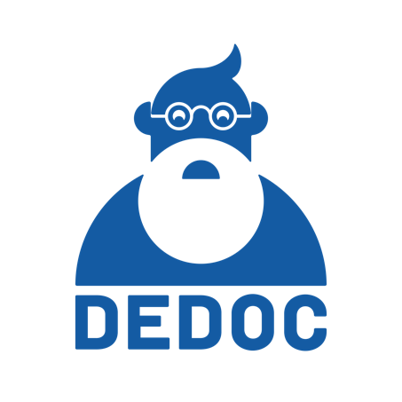

# Dedoc



## About
This project is called Dedoc and its purpose is:
* Extract text and its metadata from various types of documents (what and how was written in the document)  
* Retrieve the logical structure of the document (build tree Title -> section -> subsection and so on) 
*  Extract useful document metadata and attachments.
* Provide a framework that allows you to add new types of documents to the analysis

This project may be useful as a first step of automatic document analysis pipeline (e.g. before the NLP part)

This project has REST Api and you can run it in Docker container
To read full Dedoc documentation run the project and go to localhost:1231.
 

## Run the project
How to build and run the project

Ensure you have Git and Docker installed
 
Clone the project 
```bash
git clone https://github.com/ispras/dedoc.git

cd src/
```
 
Ensure you have Docker installed.
Start 'Dedoc' on the port 1231:
 ```bash
docker-compose up --build
```

Start Dedoc with tests:
 ```bash
 tests="true" docker-compose up --build
 ```

Now you can go to the localhost:1231 and look at the docs and examples.

You can change the port and host in the config file 'dedoc/config.py'
