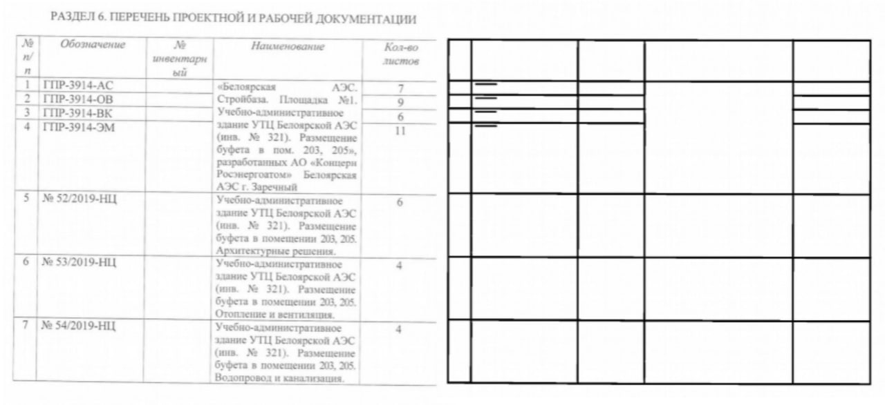

# Dedoc

[](https://dedoc.readthedocs.io/en/latest/?badge=latest)


Dedoc is an open universal system for converting documents to a unified output format. 
It extracts a document’s logical structure and content, its tables, text formatting and metadata. 
The document’s content is represented as a tree storing headings and lists of any level. 
Dedoc can be integrated in a document contents and structure analysis system as a separate module.

## Workflow


Workflow description is given [`here`](https://dedoc.readthedocs.io/en/latest/?badge=latest#workflow)

## Features and advantages
Dedoc is implemented in Python and works with semi-structured data formats (DOC/DOCX, ODT, XLS/XLSX, CSV, TXT, JSON) and none-structured data formats like images (PNG, JPG etc.), archives (ZIP, RAR etc.), PDF and HTML formats. 
Document structure extraction is fully automatic regardless of input data type. 
Metadata and text formatting are also extracted automatically. 

In 2022, the system won a grant to support the development of promising AI projects from the [Innovation Assistance Foundation (Фонд содействия инновациям)](https://fasie.ru/).

## Dedoc provides:
* Extensibility due to a flexible addition of new document formats and to an easy change of an output data format. 
* Support for extracting document structure out of nested documents having different formats. 
* Extracting various text formatting features (indentation, font type, size, style etc.). 
* Working with documents of various origin (statements of work, legal documents, technical reports, scientific papers) allowing flexible tuning for new domains. 
* Working with PDF documents containing a textual layer:
  * Support to automatically determine the correctness of the textual layer in PDF documents; 
  * Extract containing and formatting from PDF-documents with a textual layer using the developed interpreter of the virtual stack machine for printing graphics according to the format specification. 
* Extracting table data from DOC/DOCX, PDF, HTML, CSV and image formats:
  * Recognizing a physical structure and a cell text for complex multipage tables having explicit borders with the help of contour analysis. 
* Working with scanned documents (image formats and PDF without text layer):
  * Using Tesseract, an actively developed OCR engine from Google, together with image preprocessing methods. 
  * Utilizing modern machine learning approaches for detecting a document orientation, detecting single/multicolumn document page, detecting bold text and extracting hierarchical structure based on the classification of features extracted from document images.

## Document format description
The system processes different document formats. The main formats are listed below:

| Format group          | Description                                                                                                                                                                                                                                                                                                                                                                     |
|-----------------------|---------------------------------------------------------------------------------------------------------------------------------------------------------------------------------------------------------------------------------------------------------------------------------------------------------------------------------------------------------------------------------|
| Office formats        | DOCX, XLSX, PPTX and formats that canbe converted to them. Handling of these for-mats is held by analysis of format inner rep-resentation and using specialized libraries ([python-docx](https://python-docx.readthedocs.io/en/latest/), [BeautifulSoup](https://www.crummy.com/software/BeautifulSoup/bs4/doc/))                                                               |
| HTML, EML, MHTML      | HTML  documents  are  parsed  using  tagsanalysis,  HTML  handler  is  used  for  han-dling  documents  of  other  formats  in  thisgroup                                                                                                                                                                                                                                       |
| TXT                   | Only raw textual content is analyzed                                                                                                                                                                                                                                                                                                                                            |
| Archives              | Attachments of the archive are analyzed                                                                                                                                                                                                                                                                                                                                         |                                                                                                                                                                                                                                                                                                                  |
| PDF,document images   | Copyable PDF documents (with a textual layer) can be handled using [pdfminer-six](https://pdfminersix.readthedocs.io/en/latest/) library or [tabby](https://github.com/sunveil/ispras_tbl_extr) software. Non-copyable PDF documents or imagesare handled using [Tesseract-OCR](https://github.com/tesseract-ocr/tesseract), machine learning methods (including neural network methods) and [image processing methods](https://opencv.org/) |

## Examples of processed scanned documents
* Dedoc can only process scanned black and white documents, such as technical specifications, regulations, articles, etc.

<!--{:height="150px"}-->
* In particular, dedoc recognizes tabular information only from tables with explicit boundaries. Here are examples of documents that can be processed by an dedoc's image handler:

<!---->
* The system also automatically detects and corrects the orientation of scanned documents

## Example of structure extractor


## Impact
This project may be useful as a first step of automatic document analysis pipeline (e.g. before the NLP part).
Dedoc is in demand for information analytic systems, information leak monitoring systems, as well as for natural language processing systems.
The library is intended for application use by developers of systems for automatic analysis and structuring of electronic documents, including for further search in electronic documents. 

# Online-Documentation
Relevant documentation of the dedoc is available [here](https://dedoc.readthedocs.io/en/latest/)

# Demo
You can try dedoc's demo: https://dedoc-readme.hf.space.

We have a video to demonstrate how to use the system: https://www.youtube.com/watch?v=ZUnPYV8rd9A.


# Some our publications

* Article on [Habr](https://habr.com/ru/companies/isp_ras/articles/779390/), where we describe our system in detail
* [Our article](https://aclanthology.org/2022.fnp-1.13.pdf) from the FINTOC 2022 competition. We are the winners :smiley: :trophy:!

# Installation instructions
****************************************
This project has REST Api and you can run it in Docker container.
Also, dedoc can be installed as a library via `pip`.
There are two ways to install and run dedoc as a web application or a library that are described below.


## Install and run dedoc using docker 

You should have [`git`](https://git-scm.com) and [`docker`](https://www.docker.com) installed for running dedoc by this method.
This method is more flexible because it doesn't depend on the operating system and other user's limitations,
still, the docker application should be installed and configured properly.

If you don't need to change the application configuration, you may use the built docker image as well.

## Work with dedoc as service

### 1. Pull the image
```shell
docker pull dedocproject/dedoc
```

### 2. Run the container
```shell
docker run -p 1231:1231 --rm dedocproject/dedoc python3 /dedoc_root/dedoc/main.py
```

Go to [dockerhub](https://hub.docker.com/r/dedocproject/dedoc) to get more information about available dedoc images.

If you need to change some application settings, you may update `config.py` according to your needs and re-build the image. 
You can build and run image:

### 1. Clone the repository
```shell
git clone https://github.com/ispras/dedoc
```

### 2. Go to the `dedoc` directory
```shell
cd dedoc
```

### 3. Build the image and run the application
```shell
docker-compose up --build
```

### 4. Run container with tests
```shell
test="true" docker-compose up --build
```

If you need to change some application settings, you may update `config.py` according to your needs and re-build the image.


## Install dedoc using pip

If you don't want to use docker for running the application, it's possible to run dedoc locally.
However, it isn't suitable for any operating system (`Ubuntu 20+` is recommended) and
there may be not enough machine's resources for its work.
You should have `python` (`python3.8`, `python3.9` are recommended) and `pip` installed.
Installation instructions via pip are available [here](https://dedoc.readthedocs.io/en/latest/getting_started/installation.html#install-dedoc-using-pip).

## Install and run dedoc from sources
You can also install and run dedoc locally from sources using [this](https://dedoc.readthedocs.io/en/latest/getting_started/installation.html#install-and-run-dedoc-from-sources) instruction.

