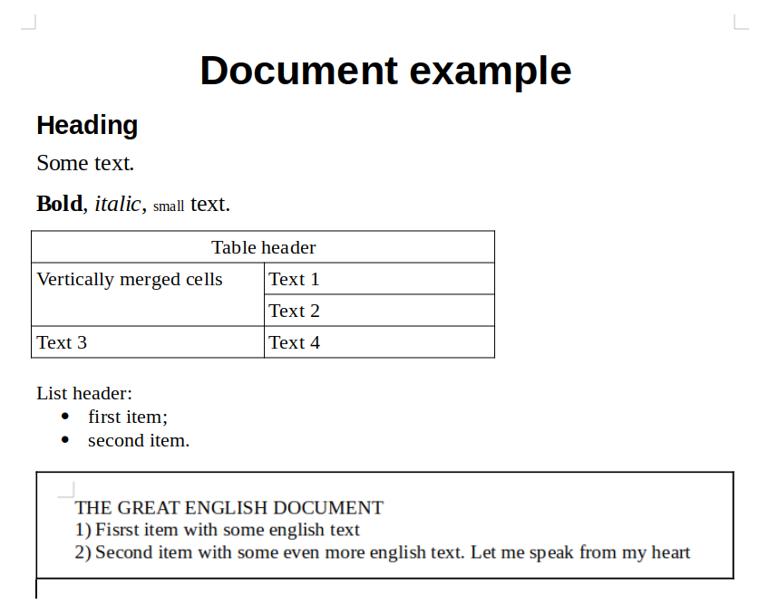

.. _return_format:

Description of the API output format
=========================================

Let's consider the example of a file :download:`example.docx <../_static/code_examples/test_dir/example_return_format.docx>`.

.. _example_image:

    document example

There are lines of the different types (heading, list item, raw text), a table and an attached image with text in the document.
Let's parse it using dedoc API and look at the output depending on the API parameters.
The instruction about :ref:`dedoc API running <dedoc_api>` may be useful.

.. _json_format:

JSON output format
------------------

Dedoc allows to get json representation of the class :class:`dedoc.data_structures.ParsedDocument`.
This format is used as a return format by default or if you use `return_format="json"` in the dictionary with API parameters.
The output structure may vary depending on the other API parameters (see :ref:`table_parameters` for more details).

Basic example
~~~~~~~~~~~~~

Let's parse the example file using default parameters:

.. literalinclude:: ../_static/code_examples/dedoc_return_format.py
    :language: python
    :lines: 9-12

The full :download:`output json file<../_static/json_format_examples/basic_example.json>` contains
serialized class :class:`dedoc.data_structures.ParsedDocument` with its content, tables, metadata and attachments.

The beginning of the document's content:

.. literalinclude:: ../_static/json_format_examples/basic_example.json
    :language: json
    :lines: 4-24

The key "node_id" means the level of the line in a document tree.
The amount of numbers separated by dot shows the depth of the line inside the document tree,
while the numbers itself show line number inside lines list with the same depth.

According to the document's styles, the line with text "Heading" is less important,
so it's is a subparagraph of the line with text "Document example":

.. literalinclude:: ../_static/json_format_examples/basic_example.json
    :language: json
    :lines: 63-66

The beginning of the document's tables:

.. literalinclude:: ../_static/json_format_examples/basic_example.json
    :language: json
    :lines: 320-350

The beginning of the document's metadata:

.. literalinclude:: ../_static/json_format_examples/basic_example.json
    :language: json
    :lines: 398-405

The document's attachments:

.. literalinclude:: ../_static/json_format_examples/basic_example.json
    :language: json
    :lines: 427

As we see, the `attachments` field is empty because the option
`with_attachments` is set to `"false"` by default (see :ref:`table_parameters`).

Example of linear structure type
~~~~~~~~~~~~~~~~~~~~~~~~~~~~~~~~

Let's parse the example file using linear output structure parameter:

.. literalinclude:: ../_static/code_examples/dedoc_return_format.py
    :language: python
    :lines: 19-22

The full :download:`output json file<../_static/json_format_examples/linear_structure_type.json>`
is almost the same but it has some differences from the basic output.

The beginning of the document's content is the same as in the previous example with default parameters:

.. literalinclude:: ../_static/json_format_examples/linear_structure_type.json
    :language: json
    :lines: 4-24

But the next document line isn't a subparagraph of the document's title (line with text "Document example"),
it has the same level in the document's tree hierarchy.

.. literalinclude:: ../_static/json_format_examples/linear_structure_type.json
    :language: json
    :lines: 66-68

All remaining document lines have the same level as well.

Example with attachments
~~~~~~~~~~~~~~~~~~~~~~~~

Let's parse the example file using `with_attachments` parameter:

.. literalinclude:: ../_static/code_examples/dedoc_return_format.py
    :language: python
    :lines: 29-32

The full :download:`output json file<../_static/json_format_examples/with_attachments.json>`
has the same document content, tables and metadata.

Unlike the previous examples, in this case we have `attachments` field filled:

.. literalinclude:: ../_static/json_format_examples/with_attachments.json
    :language: json
    :lines: 427-458

Example with base64 attachments
~~~~~~~~~~~~~~~~~~~~~~~~~~~~~~~

Let's parse the example file with attachments in base64 format:

.. literalinclude:: ../_static/code_examples/dedoc_return_format.py
    :language: python
    :lines: 39-42

The full :download:`output json file<../_static/json_format_examples/with_base64_attachments.json>`
has the same document content, tables, metadata and filled attachments as the previous example output.

The only difference is in the attachment's metadata: attachment's content is encoded and stored in the `"base64_encode"` field:

.. literalinclude:: ../_static/json_format_examples/with_base64_attachments.json
    :language: json
    :lines: 427-461

Example with parsed attachments
~~~~~~~~~~~~~~~~~~~~~~~~~~~~~~~

Let's parse the example file with attachments and their content:

.. literalinclude:: ../_static/code_examples/dedoc_return_format.py
    :language: python
    :lines: 49-52

The full :download:`output json file<../_static/json_format_examples/with_parsed_attachments.json>`
has the same document content, tables and metadata.
The `attachments` field is filled and attachments are also parsed.
In the document example the attached image has some text on it, this text has been also parsed and saved in the attachment's content.

The beginning of the document's attachments:

.. literalinclude:: ../_static/json_format_examples/with_parsed_attachments.json
    :language: json
    :lines: 427-452

Example with inserted table
~~~~~~~~~~~~~~~~~~~~~~~~~~~

Let's parse the example file with tables inserted in the document content:

.. literalinclude:: ../_static/code_examples/dedoc_return_format.py
    :language: python
    :lines: 59-62

The full :download:`output json file<../_static/json_format_examples/with_inserted_table.json>`
has the same document metadata, tables and empty attachments (as in the first example).
The difference is in the document content: it contains table's text inside.

The empty nodes with type "table" and "table_row" are added as nested nodes to the document line located before the table.
Table cells are nested nodes to the "table_row" node:

.. literalinclude:: ../_static/json_format_examples/with_inserted_table.json
    :language: json
    :lines: 189-223
