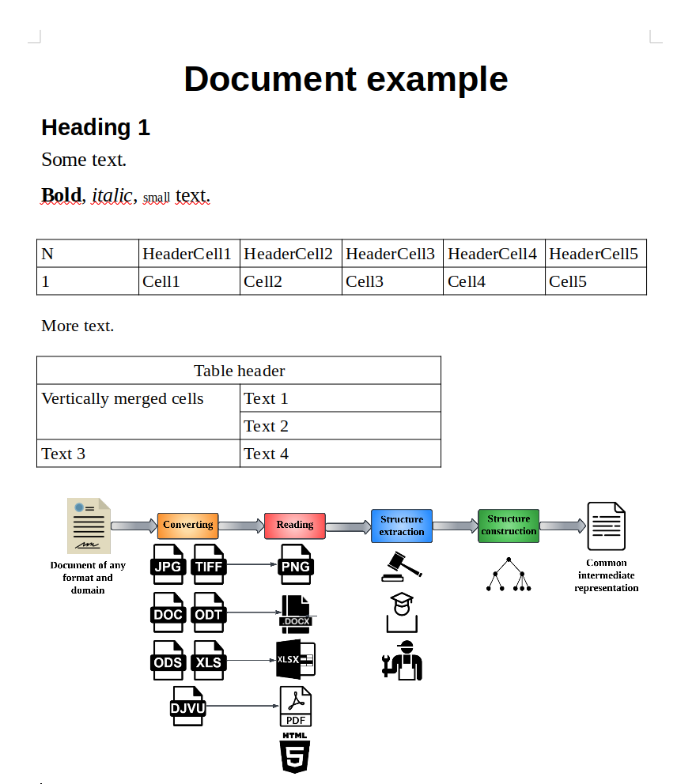

Dedoc usage tutorial
====================

Suppose you've already have dedoc library installed. Otherwise :ref:`dedoc_installation` may be useful.

You can use dedoc as an application, see :ref:`dedoc_api` for more information.

If you have installed dedoc using pip, you can use different parts of :ref:`dedoc workflow<dedoc_workflow>` separately.

Using converters
----------------

Assume we have a file :download:`example.odt <../_static/example.odt>` and we need to convert it to `example.docx` using dedoc library.
For this purpose one can use :class:`dedoc.converters.DocxConverter` class:

.. code-block:: python

    from dedoc.converters import DocxConverter

    converter = DocxConverter(config={})

Method :meth:`dedoc.converters.DocxConverter.can_convert` allows to check if the converter can convert the given file:

.. code-block:: python

    import os
    import mimetypes

    file_dir, file_name = "test_dir", "example.odt"
    file_path = os.path.join(file_dir, file_name)

    name_wo_extension, file_extension = os.path.splitext(file_name)
    file_mime = mimetypes.guess_type(file_path)[0]

    converter.can_convert(file_extension, file_mime)  # True

Since we have checked if the converter is able to convert the file,
we can convert it using :meth:`dedoc.converters.DocxConverter.do_convert` method:

.. code-block:: python

    converter.do_convert(file_dir, name_wo_extension, file_extension)  # 'example.docx'

To get the information about available converters, their methods and parameters see :ref:`dedoc_converters`.
The supported document formats that can be converted to another formats (which can be parsed by readers) are enlisted in the table :ref:`table_formats`.

Using readers
-------------

Assume we need to parse file :download:`example.docx <../_static/example.docx>`, which looks like follows:

As we see, the file contains text of different styles, two tables and an attached image.

To read the contents of this file in the intermediate representation (see :class:`dedoc.data_structures.UnstructuredDocument`)
one can use :class:`dedoc.converters.DocxReader` class:

.. code-block:: python

    from dedoc.readers import DocxReader

    reader = DocxReader(config={})

Method :meth:`dedoc.readers.DocxReader.can_read` allows to check if the reader can parse the given file:

.. code-block:: python

    import os
    import mimetypes

    file_dir, file_name = "test_dir", "example.docx"
    file_path = os.path.join(file_dir, file_name)

    name_wo_extension, file_extension = os.path.splitext(file_name)
    file_mime = mimetypes.guess_type(file_path)[0]
    reader.can_read(file_path, file_mime, file_extension)  # True

Since we have checked if the reader is able to read the file,
we can get its content (:class:`dedoc.data_structures.UnstructuredDocument`) using :meth:`dedoc.readers.DocxReader.read` method:

.. code-block:: python

    reader.read(file_path, parameters={"with_attachments": "true"})  # <dedoc.data_structures.UnstructuredDocument>

Let's save the document in the variable and look at it in more detail:

.. code-block:: python

    document = reader.read(file_path, parameters={"with_attachments": "true"})
    list(vars(document))  # ['tables', 'lines', 'attachments', 'warnings', 'metadata']

As we see, the document object has the following attributes: `lines`, `tables`, `attachments`, `metadata` and `warnings`.
Document metadata is the empty dict on this stage, because it should be filled by one of the metadata extractors (see :ref:`dedoc_metadata_extractors`).
Document warnings -- the list of strings with some warnings that occurred while document parsing.
So the most useful information is stored in `lines`, `tables` and `attachments`.

Document lines
~~~~~~~~~~~~~~

The attribute `lines` in the :class:`dedoc.data_structures.UnstructuredDocument` is a list of :class:`dedoc.data_structures.LineWithMeta`.

We can get the text of any line:

.. code-block:: python

    print(document.lines[0].line)  # Document example

Also some of the readers can detect line types based of their styles, e.g.:

.. code-block:: python

    print(document.lines[0].metadata.tag_hierarchy_level.line_type)  # header

Formatting of each line is stored in the `annotations` attribute:

.. code-block:: python

    print(document.lines[0].annotations[0])  # Indentation(0:16, 0)
    print(document.lines[0].annotations[3])  # Style(0:16, Title)

    print(document.lines[3].annotations[4])  # Size(0:14, 16.0)
    print(document.lines[3].annotations[5])  # Size(19:26, 16.0)
    print(document.lines[3].annotations[6])  # Bold(0:4, True)
    print(document.lines[3].annotations[7])  # Italic(6:12, True)
    print(document.lines[3].annotations[8])  # Size(14:19, 10.0)

See :ref:`dedoc_data_structures` to get more information about main classes forming a document line.

Document tables
~~~~~~~~~~~~~~~

The attribute `tables` in the :class:`dedoc.data_structures.UnstructuredDocument` is a list of :class:`dedoc.data_structures.Table`.

Each table is represented as a list of table rows, each row is a list of strings with cells text.

.. code-block:: python

    print(document.tables[0].cells[0][0])  # N
    print(document.tables[0].cells[1][3])  # Cell3
    print(document.tables[1].cells[3])  # ['Text 3', 'Text 4']

It also has metadata, containing table's unique identifier, cells properties (information about rowspan and colspan).

All tables have rectangular form, so if the cells are merged, in the intermediate representation they aren't and have the same contents.
Use cells properties for getting information about merged cells.

The unique identifier links the table with the previous non-empty line in the document.

Document attachments
~~~~~~~~~~~~~~~~~~~~

The attribute `attachments` in the :class:`dedoc.data_structures.UnstructuredDocument` is a list of :class:`dedoc.data_structures.AttachedFile`.

To get the information about available readers, their methods and parameters see :ref:`dedoc_readers`.
The supported document formats that can be handled by readers are enlisted in the table :ref:`table_formats`.

Using metadata extractors
-------------------------

Using attachments extractors
----------------------------

Using structure extractors
--------------------------

Using structure constructors
----------------------------

Run the whole pipeline
----------------------
