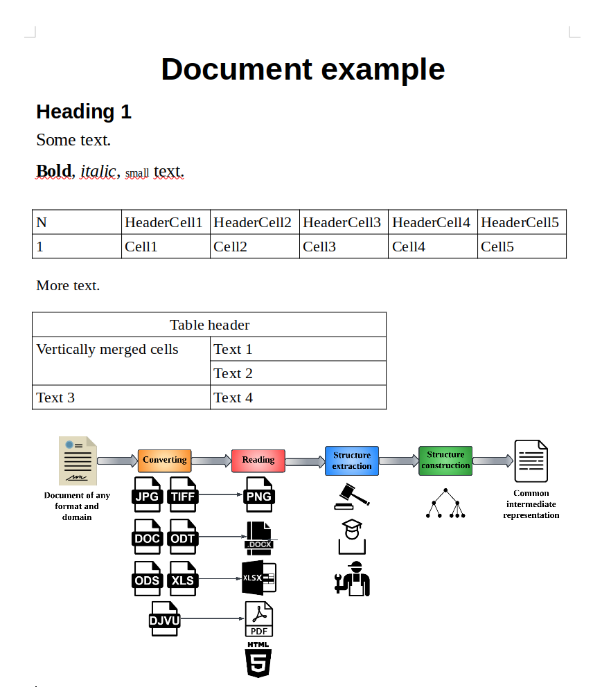

Dedoc usage tutorial
====================

Suppose you've already have dedoc library installed. Otherwise :ref:`dedoc_installation` may be useful.

You can use dedoc as an application, see :ref:`dedoc_api` for more information.

If you have installed dedoc using pip, you can use different parts of :ref:`dedoc workflow<dedoc_workflow>` separately.

In the context of this tutorial, you'll need to include certain import statements to enable the proper functioning of dedoc.

.. literalinclude:: ../_static/code_examples/dedoc_usage_tutorial.py
    :language: python
    :lines: 1-10

Using converters
----------------

Assume we have a file :download:`example.odt <../_static/code_examples/test_dir/example.odt>` and we need to convert it to `example.docx` using dedoc library.
For this purpose one can use :class:`dedoc.converters.DocxConverter` class:

.. literalinclude:: ../_static/code_examples/dedoc_usage_tutorial.py
    :language: python
    :lines: 13

Method :meth:`dedoc.converters.DocxConverter.can_convert` allows to check if the converter can convert the given file:

.. literalinclude:: ../_static/code_examples/dedoc_usage_tutorial.py
    :language: python
    :lines: 15-21

Since we have checked if the converter is able to convert the file,
we can convert it using :meth:`dedoc.converters.DocxConverter.do_convert` method:

.. literalinclude:: ../_static/code_examples/dedoc_usage_tutorial.py
    :language: python
    :lines: 22

To get the information about available converters, their methods and parameters see :ref:`dedoc_converters`.
The supported document formats that can be converted to another formats (which can be parsed by readers) are enlisted in the table :ref:`table_formats`.

.. _using_readers:

Using readers
-------------

To get the information about available readers, their methods and parameters see :ref:`dedoc_readers`.
The supported document formats that can be handled by readers are enlisted in the table :ref:`table_formats`.

Let's consider an example of using readers.
Assume we need to parse file :download:`example.docx <../_static/code_examples/test_dir/example.docx>`, which looks like follows:

.. _docx_example_image:

    document example

As we see, the file contains text of different styles, two tables and an attached image.

To read the contents of this file in the intermediate representation (see :class:`dedoc.data_structures.UnstructuredDocument`)
one can use :class:`dedoc.converters.DocxReader` class:

.. literalinclude:: ../_static/code_examples/dedoc_usage_tutorial.py
    :language: python
    :lines: 25

Method :meth:`dedoc.readers.DocxReader.can_read` allows to check if the reader can parse the given file:

.. literalinclude:: ../_static/code_examples/dedoc_usage_tutorial.py
    :language: python
    :lines: 27-32

Since we have checked if the reader is able to read the file,
we can get its content (:class:`dedoc.data_structures.UnstructuredDocument`) using :meth:`dedoc.readers.DocxReader.read` method:

.. literalinclude:: ../_static/code_examples/dedoc_usage_tutorial.py
    :language: python
    :lines: 34

Let's save the document in the variable and look at it in more detail:

.. literalinclude:: ../_static/code_examples/dedoc_usage_tutorial.py
    :language: python
    :lines: 36-38

As we see, the document object has the following attributes: `lines`, `tables`, `attachments`, `metadata` and `warnings`.
Document metadata is the empty dict on this stage, because it should be filled by one of the metadata extractors (see :ref:`dedoc_metadata_extractors` and :ref:`using_metadata_extractors`).
Document warnings -- the list of strings with some warnings that occurred while document parsing.
So the most useful information is stored in `lines`, `tables` and `attachments`.

Document lines
~~~~~~~~~~~~~~

The attribute `lines` in the :class:`dedoc.data_structures.UnstructuredDocument` is a list of :class:`dedoc.data_structures.LineWithMeta`.

We can get the text of any line:

.. literalinclude:: ../_static/code_examples/dedoc_usage_tutorial.py
    :language: python
    :lines: 40

Also some of the readers can detect line types based of their styles, e.g.:

.. literalinclude:: ../_static/code_examples/dedoc_usage_tutorial.py
    :language: python
    :lines: 41

Formatting of each line is stored in the `annotations` attribute:

.. literalinclude:: ../_static/code_examples/dedoc_usage_tutorial.py
    :language: python
    :lines: 42-49

See :ref:`dedoc_data_structures` to get more information about main classes forming a document line.

Document tables
~~~~~~~~~~~~~~~

The attribute `tables` in the :class:`dedoc.data_structures.UnstructuredDocument` is a list of :class:`dedoc.data_structures.Table`.

Each table is represented as a list of table rows, each row is a list of strings with cells text.

.. literalinclude:: ../_static/code_examples/dedoc_usage_tutorial.py
    :language: python
    :lines: 51-53

It also has metadata, containing table's unique identifier, cells properties (information about rowspan and colspan).

.. literalinclude:: ../_static/code_examples/dedoc_usage_tutorial.py
    :language: python
    :lines: 54-57

All tables have rectangular form, so if the cells are merged, in the intermediate representation they aren't and have the same contents.
Use cells properties for getting information about merged cells.

.. literalinclude:: ../_static/code_examples/dedoc_usage_tutorial.py
    :language: python
    :lines: 58-63

As we see in the :ref:`docx_example_image`, the second table has some merged cells, e.g. in the first row.
In the intermediate representation this row consists of two cells, and the second cell
contains the same text as the first one, but it's invisible.
Information about the fact that these cells are merged is stored in the colspan of the first cell.

The unique identifier links the table with the previous non-empty line in the document.

.. literalinclude:: ../_static/code_examples/dedoc_usage_tutorial.py
    :language: python
    :lines: 64-66

In the current example (:ref:`docx_example_image`), the line with the text "Bold, italic, small text." is the first non-empty line
before the first table, so the table uid is linked to this line using :class:`dedoc.data_structures.TableAnnotation`.

Document attachments
~~~~~~~~~~~~~~~~~~~~

The attribute `attachments` in the :class:`dedoc.data_structures.UnstructuredDocument` is a list of :class:`dedoc.data_structures.AttachedFile`.

In the :ref:`docx_example_image` there is an image attached to the file:

.. literalinclude:: ../_static/code_examples/dedoc_usage_tutorial.py
    :language: python
    :lines: 68-71

The `tmp_file_path` contains the path to the image saved on disk,
the image is saved in the same directory as the parent docx file.

The unique identifier of the attachent links it with the previous non-empty line in the document.
In our :ref:`docx_example_image` it is a line with text "More text.".

.. literalinclude:: ../_static/code_examples/dedoc_usage_tutorial.py
    :language: python
    :lines: 72-74

The annotation uid is linked to the line using :class:`dedoc.data_structures.AttachAnnotation`.

.. _using_metadata_extractors:

Using metadata extractors
-------------------------

Continue the example from the :ref:`previous section <using_readers>`.

The reader returned the intermediate representation of the document -- :class:`dedoc.data_structures.UnstructuredDocument`.
If we need to get some additional information about the file e.g. document subject or author,
we can add some metadata using :class:`dedoc.metadata_extractors.DocxMetadataExtractor`.

.. literalinclude:: ../_static/code_examples/dedoc_usage_tutorial.py
    :language: python
    :lines: 77

Method :meth:`dedoc.metadata_extractors.DocxMetadataExtractor.can_extract` allows to check if
the metadata extractor can extract metadata from the given file:

.. literalinclude:: ../_static/code_examples/dedoc_usage_tutorial.py
    :language: python
    :lines: 78

To extract metadata, one can add them to the document using :meth:`dedoc.metadata_extractors.DocxMetadataExtractor.add_metadata` method.

.. literalinclude:: ../_static/code_examples/dedoc_usage_tutorial.py
    :language: python
    :lines: 79-83

As we see, the attribute `metadata` has been filled with some metadata fields.
The list of common fields for any metadata extractor along with the specific fields
for different document formats are enlisted in :ref:`dedoc_metadata_extractors`.

Using attachments extractors
----------------------------

In the section :ref:`using_readers` we already got the attachments of the file along with its other contents.
If there is a need to extract attachments without reading the whole content of the document,
one can use :ref:`dedoc_attachments_extractors`.

For example, in the :ref:`docx_example_image` we can use :class:`dedoc.attachments_extractors.DocxAttachmentsExtractor`.

.. literalinclude:: ../_static/code_examples/dedoc_usage_tutorial.py
    :language: python
    :lines: 87

Method :meth:`dedoc.attachments_extractors.DocxAttachmentsExtractor.can_extract` allows to check if the attachments extractor can extract attachments from the given file:

.. literalinclude:: ../_static/code_examples/dedoc_usage_tutorial.py
    :language: python
    :lines: 88

Since we have checked if the extractor can extract attachments from the file,
we can extract them it using :meth:`dedoc.attachments_extractors.DocxAttachmentsExtractor.get_attachments` method:

.. literalinclude:: ../_static/code_examples/dedoc_usage_tutorial.py
    :language: python
    :lines: 89-90

As we see, attachment extractors return the same list of :class:`dedoc.data_structures.AttachedFile`,
as in the attribute `attachments` of the :class:`dedoc.data_structures.UnstructuredDocument`,
that we can get via readers (see :ref:`using_readers`).

See :ref:`dedoc_attachments_extractors` to get more information about available extractors, their methods and parameters.

.. _using_structure_extractors:

Using structure extractors
--------------------------

After sections :ref:`using_readers` and :ref:`using_metadata_extractors` we got an intermediate representation of the document content and its metadata.
The next step is to extract document structure, i.e. to find the :class:`dedoc.data_structures.HierarchyLevel` for each document line.
This class contains information about the type and the level of the line (or its importance in the document).

Let's extract the default structure based on the document styles:

.. literalinclude:: ../_static/code_examples/dedoc_usage_tutorial.py
    :language: python
    :lines: 94-97

As we see, the `hierarchy_level` has been filled.

See :ref:`other_structure` for more details about the default document structure.
Use :ref:`dedoc_structure_extractors` to get the information about available structure extractors, their methods and parameters.

Using structure constructors
----------------------------

After we got the document content with hierarchy levels of each line (see :ref:`using_readers`, :ref:`using_metadata_extractors` and :ref:`using_structure_extractors`),
it's possible to make the result class :class:`dedoc.data_structures.ParsedDocument`.

Let's construct the tree structure of the document:

.. literalinclude:: ../_static/code_examples/dedoc_usage_tutorial.py
    :language: python
    :lines: 101-104

As we see, parsed document has similar attributes as :class:`dedoc.data_structures.UnstructuredDocument`.
The main difference is in the `content` attribute, that contains hierarchical document structure and tables.

.. literalinclude:: ../_static/code_examples/dedoc_usage_tutorial.py
    :language: python
    :lines: 106-108

To get more information about :class:`dedoc.data_structures.ParsedDocument`, :class:`dedoc.data_structures.DocumentContent`
and other classes, that form the output format, see :ref:`dedoc_data_structures`.

See :ref:`dedoc_structure_constructors` for the description of available structure constructors and structure types.
The description of :ref:`API output JSON format <json_format>` also may be useful.

Run the whole pipeline
----------------------

For running the whole pipeline with all readers, metadata and structure extractors, structure constructors,
one may use manager class (see :ref:`dedoc_manager` for more details).

.. literalinclude:: ../_static/code_examples/dedoc_usage_tutorial.py
    :language: python
    :lines: 112-117

Manager allows to run workflow (see :ref:`dedoc_workflow`) for a file of any format supported by dedoc (see :ref:`table_formats`).
One can also make a custom `config` and `manager_config` (parameters of the manager constructor) for more flexible usage of the library.