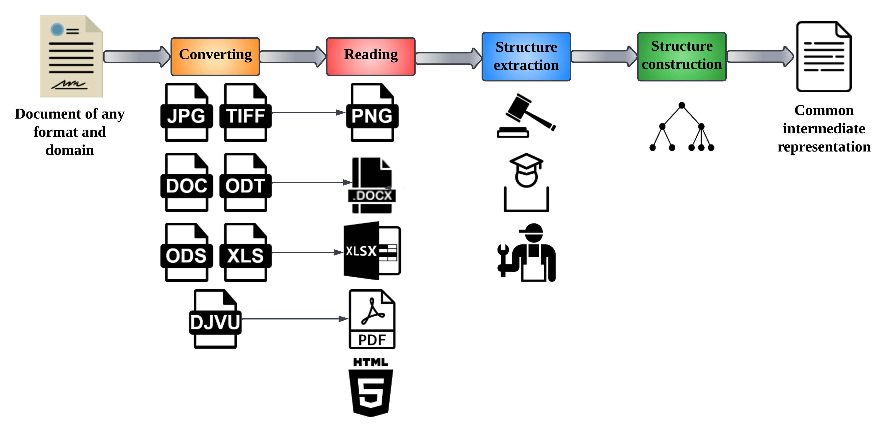

Dedoc: the system for document structure extraction
===================================================

.. image:: https://github.com/ispras/dedoc/raw/master/dedoc_logo.png
        :align: center

Dedoc is an open universal system for converting textual documents of different formats to a unified output representation.

Dedoc allows to extract the following data from the documents:
    * **Content** - textual lines of the document in the reading order;
    * **Annotations** of the lines - formatting of the text for its visual representation;
    * **Structure** - type of each document line and its level (importance) in the document hierarchy;
    * **Tables** - tables that are found in the document;
    * **Attachments** - files, attached to the document;
    * **Metadata** - some additional information about the file, e.g. creation date or the author.

Dedoc can be integrated in some system for document contents and structure analysis as a separate module.
Dedoc can be used as a python library, API service or a docker container.

.. _dedoc_workflow:

Workflow
--------

The main workflow consists of the following stages:
    1. **Converting** document to one of the supported formats.
    There are some documents that can be easily converted to another well-known format, e.g. odt to docx.
    In this case we use converters to convert these documents to one common format in order to facilitate the subsequent reading.
    The list of supported document formats and which of them should be converted is shown in the table :ref:`table_formats`.

    2. **Reading** the converted document to get intermediate representation of the document.
    This representation include document lines with annotations, tables, attachments and metadata.
    The table :ref:`table_formats` shows which information can be extracted according to the document's format.

    3. **Structure extraction** from the document.
    This stage includes line types and hierarchy levels identification.
    In the section :ref:`structure` supported types of structure are enlisted.

    4. **Structure construction** of the output.
    The result document structure representation may vary and
    structure constructors may use the information about lines types and levels differently.
    For example, the tree of document lines may be built.

Reading documents using dedoc
-----------------------------

Dedoc allows to get the common intermediate representation for the documents of various formats.
The resulting output of any reader is a class :class:`~dedoc.data_structures.UnstructuredDocument`.
See :ref:`readers' annotations <readers_annotations>` and :ref:`readers' line types <readers_line_types>`
to get more details about information that can be extracted by each available reader.

.. _table_formats:

.. list-table:: Supported documents formats and the reader's output
   :widths: 40 25 10 10 15
   :header-rows: 1
   :class: tight-table

   * - Document format
     - Reader
     - Lines
     - Tables
     - Attachments

   * - zip, tar, tar.gz, rar, 7z
     - :class:`~dedoc.readers.ArchiveReader`
     - `-`
     - `-`
     - `+`

   * - csv, tsv
     - :class:`~dedoc.readers.CSVReader`
     - `-`
     - `+`
     - `-`

   * - docx
     - :class:`~dedoc.readers.DocxReader`
     - `+`
     - `+`
     - `+`

   * - doc, odt, rtf
     - convert to docx using :class:`~dedoc.converters.DocxConverter`
     - `+`
     - `+`
     - `+`

   * - xlsx
     - :class:`~dedoc.readers.ExcelReader`
     - `-`
     - `+`
     - `+`

   * - xls, ods
     - convert to xlsx using :class:`~dedoc.converters.ExcelConverter`
     - `-`
     - `+`
     - `+`

   * - pptx
     - :class:`~dedoc.readers.PptxReader`
     - `+`
     - `+`
     - `+`

   * - ppt, odp
     - convert to pptx using :class:`~dedoc.converters.PptxConverter`
     - `+`
     - `+`
     - `+`

   * - eml
     - :class:`~dedoc.readers.EmailReader`
     - `+`
     - `+`
     - `+`

   * - html, shtml
     - :class:`~dedoc.readers.HtmlReader`
     - `+`
     - `+`
     - `-`

   * - mhtml, mhtml.gz, mht, mht.gz
     - :class:`~dedoc.readers.MhtmlReader`
     - `+`
     - `+`
     - `+`

   * - json
     - :class:`~dedoc.readers.JsonReader`
     - `+`
     - `-`
     - `+`

   * - txt, txt.gz
     - :class:`~dedoc.readers.RawTextReader`
     - `+`
     - `-`
     - `-`

   * - xml
     - convert to txt using :class:`~dedoc.converters.TxtConverter`
     - `+`
     - `-`
     - `-`

   * - pdf (without textual layer), png
     - :class:`~dedoc.readers.PdfImageReader`
     - `+`
     - `+`
     - `-`

   * - pdf (with textual layer)
     - :class:`~dedoc.readers.PdfTabbyReader`, :class:`~dedoc.readers.PdfTxtlayerReader`
     - `+`
     - `+`
     - `+`

   * - pdf
     - :class:`~dedoc.readers.PdfAutoReader`
     - `+`
     - `+`
     - `+`

   * - bmp, dib, eps, gif, hdr, j2k, jfif, jp2, jpe, jpeg, jpg, pbm, pcx, pgm, pic, png, pnm, ppm, ras, sgi, sr, tiff, webp
     - convert to png using :class:`~dedoc.converters.PNGConverter`
     - `+`
     - `+`
     - `-`

   * - djvu
     - convert to pdf using :class:`~dedoc.converters.PDFConverter`
     - `+`
     - `+`
     - `+`

   * - note.pickle
     - :class:`~dedoc.readers.NoteReader`
     - `+`
     - `-`
     - `-`

.. _structure:

Structure extraction using dedoc
--------------------------------

Dedoc allows to extract structure from the documents of some specific domains.
For this purpose classifiers are used to predict the type of each document line/paragraph.
Then some rules (mostly based on regular expressions) are used to find a hierarchy level of each line for the document tree representation.

It's possible to define a new structure extractor in order to handle documents of new domains.
Currently the following domains can be handled:

    * Russian laws (:ref:`structure description <law_structure>`).
    * Russian technical specifications (:ref:`structure description <tz_structure>`).
    * Russian thesis for bachelor or master degree (:ref:`structure description <diploma_structure>`).

For a document of unknown or unsupported domain there is an option to use default structure extractor
(``document_type=other`` at :ref:`api_parameters`), the default document structure described :ref:`here <other_structure>`.

.. toctree::
   :maxdepth: 1
   :caption: Getting started

   getting_started/installation
   getting_started/usage

.. toctree::
   :maxdepth: 1
   :caption: Tutorials

   tutorials/add_new_doc_type
   tutorials/creating_document_classes

.. toctree::
   :maxdepth: 1
   :caption: Parameters description

   parameters/structure_type
   parameters/attachments_handling
   parameters/tables_handling
   parameters/pdf_handling
   parameters/other_formats_handling

.. toctree::
   :maxdepth: 1
   :caption: Dedoc API usage

   dedoc_api_usage/api
   dedoc_api_usage/api_schema
   dedoc_api_usage/return_format

.. toctree::
   :maxdepth: 1
   :caption: Readers output

   readers_output/annotations
   readers_output/line_types

.. toctree::
   :maxdepth: 1
   :caption: Structure types

   structure_types/other
   structure_types/law
   structure_types/tz
   structure_types/diploma

.. toctree::
   :maxdepth: 1
   :caption: Package Reference

   modules/manager
   modules/data_structures
   modules/converters
   modules/readers
   modules/attachments_extractors
   modules/metadata_extractors
   modules/structure_extractors
   modules/structure_constructors

.. toctree::
   :maxdepth: 2
   :caption: Notes
   :hidden:

   changelog
