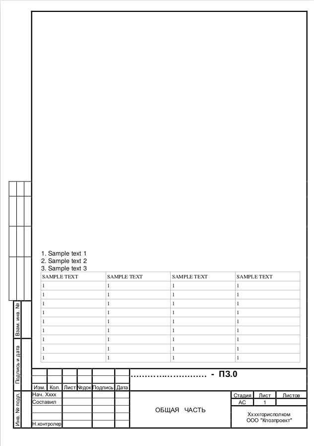
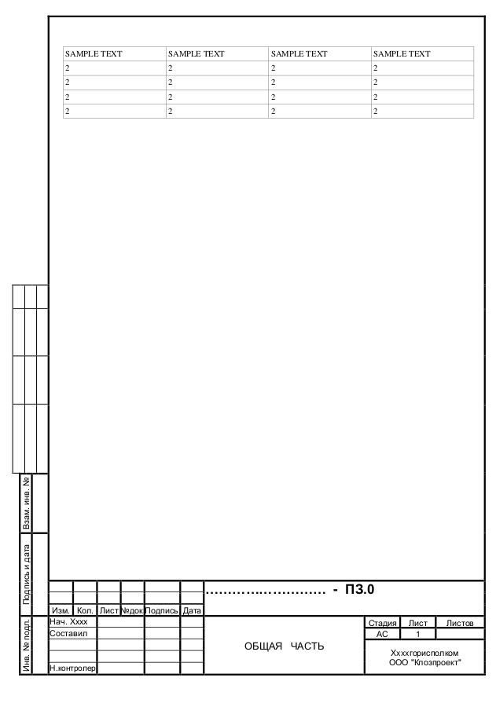
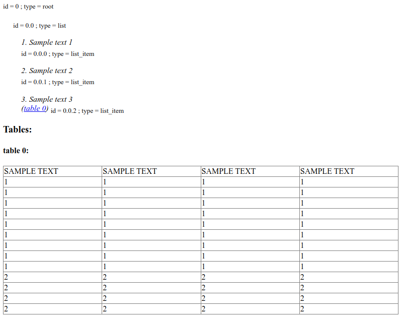

.. _gost_frame_handling:

GOST frame handling
====================

.. flat-table:: Parameters for GOST frame handling
    :widths: 5 5 3 15 72
    :header-rows: 1
    :class: tight-table

    * - Parameter
      - Possible values
      - Default value
      - Where can be used
      - Description

    * - need_gost_frame_analysis
      - True, False
      - False
      - * :meth:`dedoc.DedocManager.parse`
        * :meth:`dedoc.readers.PdfAutoReader.read`, :meth:`dedoc.readers.PdfTabbyReader.read`, :meth:`dedoc.readers.PdfTxtlayerReader.read`, :meth:`dedoc.readers.PdfImageReader.read`
        * :meth:`dedoc.readers.ReaderComposition.read`
      - This option is used to enable GOST (Russian government standard "ГОСТ Р 21.1101") frame recognition for PDF documents or images.

The content of each page of some technical documents is placed in special GOST frames. An example of GOST frames is shown in the example below (:ref:`example_gost_frame`).
Such frames contain meta-information and are not part of the text content of the document. Based on this, we have implemented the functionality for ignoring GOST frames in documents, which works for:

    * Copyable PDF documents (:class:`dedoc.readers.PdfTxtlayerReader` and :class:`dedoc.readers.PdfTabbyReader`);
    * Non-copyable PDF documents and Images (:class:`dedoc.readers.PdfImageReader`).

If parameter ``need_gost_frame_analysis=True``, the GOST frame itself is ignored and only the contents inside the frame are extracted.

.. _example_gost_frame:

Examples of GOST frame
----------------------
For example, your send PDF-document with two pages  :download:`PDF-document with two pages <../_static/gost_frame_data/document_with_gost_frame.pdf>`:

Parameter's usage
-----------------

.. code-block:: python

    import requests

    data = {
        "pdf_with_text_layer": "auto_tabby",
        "need_gost_frame_analysis": "true",
        "return_format": "html"
    }
    with open(filename, "rb") as file:
        files = {"file": (filename, file)}
        r = requests.post("http://localhost:1231/upload", files=files, data=data)
        result = r.content.decode("utf-8")

Request's result
----------------

