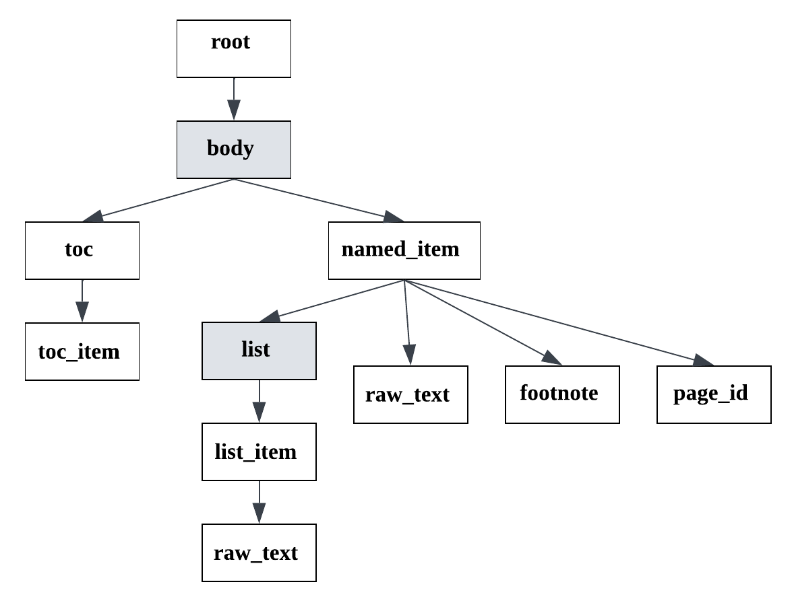

.. _diploma_structure:

Diploma structure type
======================

This structure type is used for analysing student's works (in Russian):

    * Course work (курсовая работа);
    * Thesis for a bachelor degree (выпускная квалификационная работа, бакалаврская работа);
    * Thesis for a master degree (магистерская диссертация).

You can see the :download:`example  <../_static/structure_examples/diploma.docx>` of the document of this structure type.

As a rule, the documents of this type have docx (doc, odt etc.) or pdf format.
Therefore, it is recommended to use this structure representation for documents of these formats.
For parsing pdf documents the parameter pdf_with_text_layer="auto_tabby" is recommended (see :ref:`api_parameters`).

There are the following line types in the diploma structure type:
    * root;
    * body;
    * named_item;
    * toc;
    * toc_item;
    * list;
    * list_item;
    * raw_text;
    * footnote;
    * page_id.

An exemplary format schema looks as follows:

.. _diploma_schema:

    An exemplary schema of the diploma structure type

The grey rectangles mean auxiliary nodes with empty text.

In the following description we will speak about the node depth inside the document tree as a node importance.
The closer the node is to the document tree root, the more important it is.

The detailed description of each line type:
    * **root**: node containing the text of the title page.

        There is only one root node in any document.
        It is obligatory for any document of diploma type.
        All other document lines are children of the root node.

    * **body**: node containing the rest of the document content.

        There is only one body node in any diploma document.
        It is obligatory for any document of diploma type.
        This is an auxiliary node with empty text, it is nested in the root node.
        All of the rest document lines (except root) are children of the body node.

    * **named_item**: node with text of some header inside the document body.

        Document header is visually highlighted and may be present in the document TOC (Table of contents).
        The named_item nodes may be nested, i.e. have different importance.
        The named_item node is less important than root and body,
        named_item node with highest possible importance is equal to toc node, nested named_item nodes are less important.

    * **toc**: header of the TOC (Table of contents).

        There is only one toc node in any diploma document.
        The node of this type contains text like "Содержание".
        The toc node is less important than root and body,
        has the equal depth as named_item node with highest possible importance,
        and more important than the rest of the nodes.

    * **toc_item**: one item of the Table of contents.

        It contains the header text and the page where it is located.
        All toc_item nodes are children of the toc node, i.e. are less important.

    * **list**: auxiliary tree node for marking a list beginning.

        It is less important than the named_item, so it is nested to the node of this type.
        There is a difference between the importance of different list types,
        see :ref:`other_structure` for more details.

    * **list_item**: one item of some list.

        The role of this node is the same as in :ref:`other_structure`.

    * **raw_text**: node referring to a simple document line.

        The importance of a node with raw_text type is less than the importance
        of previous node with type body, named_item, toc, toc_item, list, list_item.
        In other cases, it is the same as the previous line has.

    * **footnote**: node containing text of a document footnote/endnode.

        Footnotes are located in the end of a document page and
        there is a link between a footnote and some document line.
        They have the same importance as raw_text lines.
        **In pdf documents footnotes are separate nodes with footnote type,
        but in the formats without strict page separation (docx, html, etc.)
        footnote's text is stored in the annotation of the line referring to this footnote.**
        The documentation of the class :class:`dedoc.data_structures.LinkedTextAnnotation` may be helpful.

    * **page_id**: node containing the text with page number.

        Nodes of this type have the same importance as raw_text lines.
        **In pdf documents page_id lines are separate nodes,
        but in the formats without strict page separation (docx, html, etc.) they are absent.**
