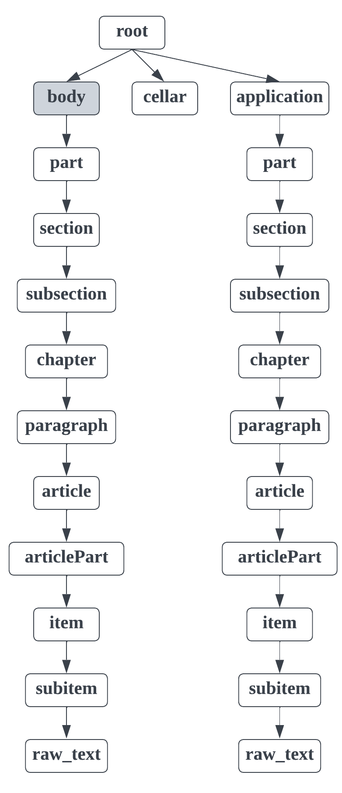
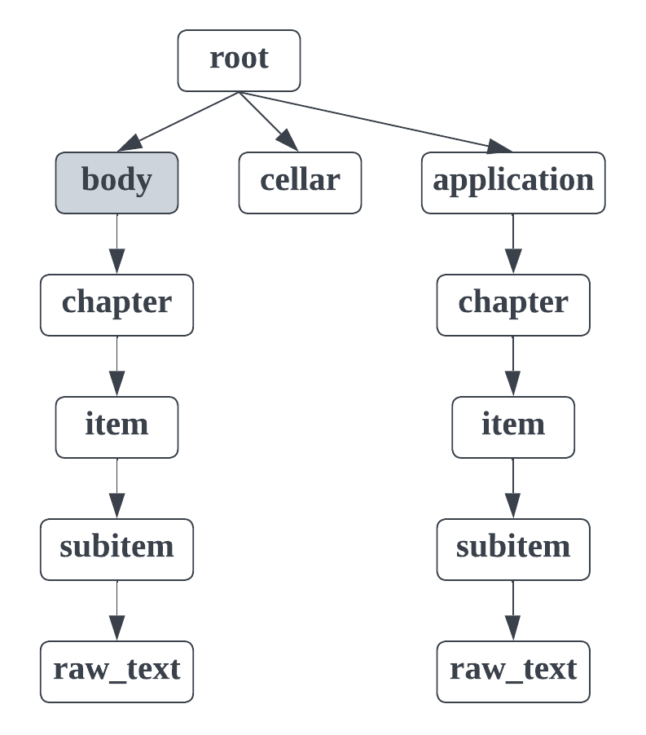

.. _law_structure:

Law structure type
==================

This structure type is used for analysing Russian laws of different types:

* decree (постановление);
* order (приказ);
* bylaw (распоряжение);
* definition (определение);
* directive (директива);
* code (кодекс);
* law (закон);
* constitution (конституция);
* edict (указ);
* state (положение);
* instruction (инструкция);
* federal law (федеральный закон).

We consider documents that have some common template:

* The document starts with a title.
* After the document title the content of the document starts with a header.
* In the end of the document there may be applications (optional).

In the dedoc library two law types are separated and for each type specific structure is extracted:

* **Siple law**. The structure type for all Russian law types except order (приказ), state (положение) and instruction (инструкция) we will call simple law.
* **Foiv law**. The structure type for law types order (приказ), state (положение) and instruction (инструкция) we will call foiv law.

The dedoc library allows to determine law type (simple law, foiv law) automatically during document analysis.
Below there is an output structure description of each law type in more details.

The dedoc library allows to handle Russian laws of all aforesaid types in txt, html, docx (doc, odt), pdf and png (jpg, bmp, etc.) formats.

In the following description we will speak about the node depth inside the document tree as a node importance.
The closer the node is to the document tree root, the more important it is.

.. _simple_law_structure:

Simple law structure type
-------------------------

You can see the :download:`example  <../_static/structure_examples/law.html>` of the document of this structure type.

There are the following line types in the law structure type:
    * root;
    * body;
    * part;
    * section;
    * subsection;
    * chapter;
    * paragraph;
    * article;
    * articlePart;
    * item;
    * subitem;
    * cellar;
    * application;
    * raw_text.

An exemplary format schema looks as follows:

.. _law_schema:

    An exemplary schema of the simple law structure type

The grey rectangles mean auxiliary nodes with empty text.
The higher the rectangle is, the more important the node with this type is.

The detailed description of each line type:
    * **root**: node containing the text of the document title.

        There is only one root node in any document.
        It is obligatory for any document of law type.
        All other document lines are children of the root node.

    * **body**: node containing the law content without cellar and applications.

        There is only one body node in any document.
        It is obligatory for any document of law type.

    * **part**: node containing the text of law's part header ("часть").

        This node type is optional, not all laws contain parts.

    * **section**: node containing the text of law's section header ("раздел").

        This node type is optional, not all laws contain sections.

    * **subsection**: node containing the text of law's subsection header (lines numbered by roman numbers like "IV.").

        This node type is optional, not all laws contain subsections.

    * **chapter**: node containing the text of law's chapter header ("глава").

        This node type is optional, not all laws contain chapters.

    * **paragraph**: node containing the text of law's paragraph header (§).

        This node type is optional, not all laws contain paragraphs.

    * **article**: node containing the text of law's article header ("статья").

        This node type is optional, not all laws contain articles.

    * **articlePart**: node containing the text of law's articlePart (digit dotted lists).

        The text of this node consists only of numeration, e.g. "1.".
        The rest of the line's text is located in the nested raw_text node.

    * **item**: node containing the text of law's item (digit bracket lists).

        The text of this node consists only of numeration, e.g. "1)".
        The rest of the line's text is located in the nested raw_text node.

    * **subitem**: node containing the text of law's subitem (letter bracket lists).

        The text of this node consists only of numeration, e.g. "a)".
        The rest of the line's text is located in the nested raw_text node.

    * **cellar**: node containing the text of law's cellar.

        Cellar is situated after body node and contains the information about the legislature passing the law and the name of the person who signed it.

    * **application**: node containing the text of law's application header (starts with "приложение" or "утверждены").

        This node type is optional, not all laws contain applications.

    * **raw_text**: node referring to a simple document line.

        It has the least importance in the document tree hierarchy,
        so it is situated in the leaves of the tree.
        It is nested to the node corresponding the previous line with more important type.

.. _foiv_law_structure:

Foiv law structure type
-----------------------

You can see the :download:`example  <../_static/structure_examples/foiv_law.html>` of the document of this structure type.

There are the following line types in the foiv law structure type:
    * root;
    * body;
    * chapter;
    * item;
    * subitem;
    * cellar;
    * application;
    * raw_text.

An exemplary format schema looks as follows:

.. _foiv_law_schema:

    An exemplary schema of the foiv law structure type

The grey rectangles mean auxiliary nodes with empty text.
The higher the rectangle is, the more important the node with this type is.

The detailed description of each line type:
    * **root**: node containing the text of the document title.

        There is only one root node in any document.
        It is obligatory for any document of law type.
        All other document lines are children of the root node.

    * **body**: node containing the law content without cellar and applications.

        There is only one body node in any document.
        It is obligatory for any document of law type.

    * **chapter**: node containing the text of law's chapter header ("глава" or lines numbered by roman numbers).

        This node type is optional, not all laws contain chapters.

    * **item**: node containing the text of law's item (digit dotted lists).

        The text of this node consists only of numeration, e.g. "1.".
        The rest of the line's text is located in the nested raw_text node.

    * **subitem**: node containing the text of law's subitem (digit or letter bracket lists).

        The text of this node consists only of numeration, e.g. "1)".
        The rest of the line's text is located in the nested raw_text node.

    * **cellar**: node containing the text of law's cellar.

        Cellar is situated after body node and contains the information about the legislature passing the law and the name of the person who signed it.

    * **application**: node containing the text of law's application header (starts with "приложение" or "утверждены").

        This node type is optional, not all laws contain applications.

    * **raw_text**: node referring to a simple document line.

        It has the least importance in the document tree hierarchy,
        so it is situated in the leaves of the tree.
        It is nested to the node corresponding the previous line with more important type.
