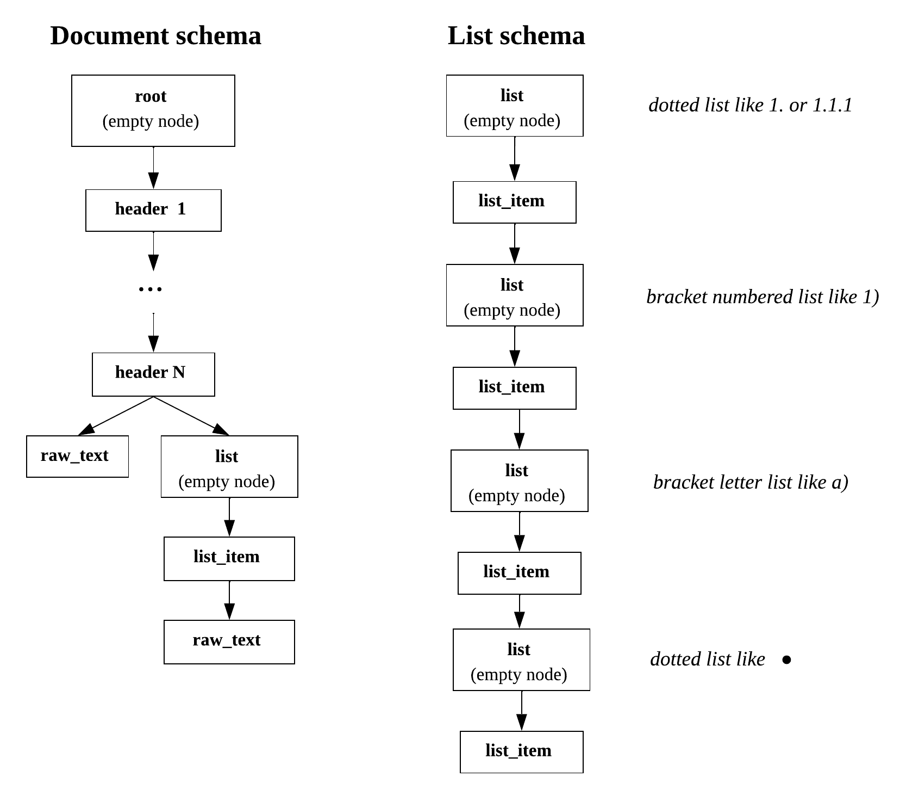

.. _other_structure:

Default document structure type
===============================

Below we will consider document lines as nodes of the document tree.
In some cases document lines are paragraphs of the text (e.g. in docx).

There are the following line types in the default structure type:
    * root;
    * header;
    * list;
    * list_item;
    * raw_text.

The output document structure depends on the styles, that have been found in the input file.
For example, the paragraphs of the docx document can have style "heading",
automatic lists provide the information about list depth if it's nested and so on.
List items can also be found using regular expressions:
dotted lists, bracket lists and bullet lists are analysed.

An exemplary format schema looks as follows:

.. _default_schema:

    An exemplary schema of the default document structure

In the following description we will speak about the node depth inside the document tree as a node importance.
The closer the node is to the document tree root, the more important it is.

The detailed description of each line type:
    * **root**: auxiliary tree node of the highest importance.

        There is only one root node in any document.
        This node is obligatory for any document.
        Its text is an empty string.
        All other document lines are children of the root node.

    * **header**: header nodes are less important than the root, but more important than the rest of the nodes.

        This type of node is optional, i.e. there may be documents without headers.
        Headers may be nested if they have the different importance in the document.
        Header node contain the text and other information about the document line, that is header in the document.

    * **list**: auxiliary tree node for marking a list beginning.

        Its text is an empty string.
        This type of node is optional, it occurs only if lists are found in the given document.
        For each list type (dotted, bracket, bullet) the new list node is created.
        This type of node is more important than list_item and raw_text.
        List nodes for less important lists are are nested into list items of more important list types.
        For example, list node for bullet list beginning is less important than a list item of a dotted list.
        The hierarchy of lists importance is represented on the :ref:`schema <default_schema>`.
        This rule can be broken if there is additional information about list depth in the document (e.g. in docx).

    * **list_item**: one item of some list.

        It is more important than raw_text nodes, but it is nested into the corresponding list node.
        This type of node is occurred only along with the auxiliary parent list node.

    * **raw_text**: node referring to a simple document line.

        It has the least importance in the document tree hierarchy,
        so it is situated in the leaves of the tree.
        It is nested to the node corresponding the previous line with more important type.
