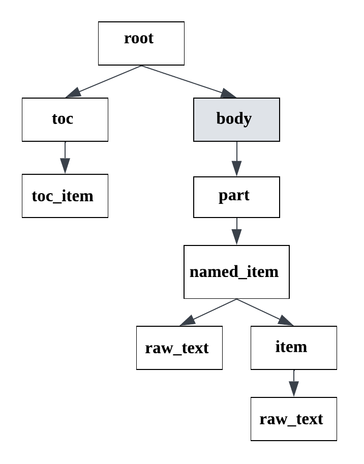

.. _tz_structure:

Technical specification structure type
======================================

This structure type is used for Russian technical specifications analysis ("техническое задание").
You can see the :download:`example  <../_static/structure_examples/tz.docx>` of the document of this structure type.

We consider documents that have some common template:

* The document starts with a title.
* After document title there may be a table of contents (it may be absent).
* After TOC or the document title (if there isn't TOC) the content of the document starts with a header.
* As a rule, headers are numbered.

There are the following line types in the technical specification structure type:
    * root;
    * toc;
    * toc_item;
    * body;
    * part;
    * named_item;
    * item;
    * raw_text.

An exemplary format schema looks as follows:

.. _tz_schema:

    An exemplary schema of the diploma structure type

The grey rectangles mean auxiliary nodes with empty text.

In the following description we will speak about the node depth inside the document tree as a node importance.
The closer the node is to the document tree root, the more important it is.

The detailed description of each line type:

    * **root**: node containing the text of the document title.

        There is only one root node in any document.
        It is obligatory for any document of diploma type.
        All other document lines are children of the root node.

    * **toc**: header of the TOC (Table of contents).

        There is only one toc node (if present) in any document.
        The node of this type contains text like "Содержание".
        The toc node is less important than root, has the equal depth as body
        and more important than the rest of the nodes.
        The toc node is optional -- there are cases when documents don't have a TOC.

    * **toc_item**: one item of the Table of contents.

        It contains the header text and the page where it is located.
        All toc_item nodes are children of the toc node, i.e. are less important.
        The toc_item is an optional node, it occurs along with the toc node.

    * **body**: node containing the rest of the document content.

        There is only one body node in any document.
        It is obligatory for any document of technical specification type.
        This is an auxiliary node with empty text, it is nested in the root node along with a table of contents (toc node).
        All of the rest document lines (except root and toc) are children of the body node.

    * **part**: header node of great importance.

        If the document header differs greatly from the most of other body text lines (by font size, capital letters), it has this type.
        It is optional, because if headers don't differ greatly, other types are used (named_item ot item).
        Nodes of part type are nested in the body node and are more important than
        the rest of body nodes (named_item, item, raw_text).

    * **named_item**: header node that visually differs from the rest of textual lines.

        If the text is a document header (is an element of dotted list, is highlighted by bold font, capital letters, etc.), it has this type.
        It is optional, because if headers aren't visually highlighted, item type is used.
        Nodes of named_item type are nested in the part or body (if parts are absent) nodes
        and are more important than item and raw_text nodes.

    * **item**: header node with numeration or an element of any list.

        The text of item nodes consists of numeration only, e.g. "1)".
        The rest of the line's text is located in the nested raw_text node.
        Nodes of item type are nested in the named_item, part (if named_item nodes are absent) or
        body (if part, named_item nodes are absent) nodes and are more important than raw_text nodes.

    * **raw_text**: node referring to a simple document line.

        It has the least importance in the document tree hierarchy,
        so it is situated in the leaves of the tree.
        It is nested to the node corresponding the previous line with more important type.
