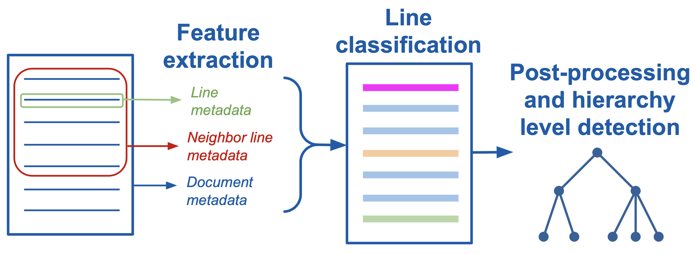

.. _add_structure_type:

Adding support for a new structure type to Dedoc
================================================

Dedoc supports several structure types, e.g. Russian :ref:`laws <law_structure>` or :ref:`technical specifications <tz_structure>`
according to the description of the  :ref:`structure extraction step <structure>`.
However, one may need to add support for their own structure type, e.g. for English documents.

It's possible to define a new structure extractor in order to handle documents of new domains.
There are two main ways of creating a structure extractor that are used in Dedoc:

    * Usage of domain-specific rules and some heuristics to detect lines types and their hierarchy (see :ref:`heuristic_structure_extractor`).
    * Document lines classification with machine learning and post-processing using domain-specific rules (see :ref:`classification_structure_extractor`).

.. note::
    A custom structure extractor should fill ``hierarchy_level`` (:class:`~dedoc.data_structures.HierarchyLevel`)
    field of :class:`~dedoc.data_structures.LineMetadata` for each document line (:class:`~dedoc.data_structures.LineWithMeta`).
    See :ref:`add_structure_type_hierarchy_level` and documentation of the :class:`~dedoc.data_structures.HierarchyLevel` class
    to get more information about lines hierarchy levels.

While implementing a custom structure extractor, there are no limits about its architecture and used methods.
The two aforesaid methods are only examples how the document structure can be parsed.
As an alternative, a structure extractor can automatically detect subtypes of some structure and then call more specific structure extractors.
For instance, there are `simple law` and `foiv law` subtypes in :ref:`law structure type <law_structure>`.
Still, the rule about filling ``hierarchy_level`` field remains obligatory as it is the result of the structure extraction process.

.. _heuristic_structure_extractor:

Implementing structure extractor using heuristic rules
------------------------------------------------------

If there are strict rules describing a document structure, it's possible to get by only with regular expressions
while implementing a new structure extractor.
A code example of such a structure extractor can be found
`here <https://github.com/ispras/dedoc/blob/master/dedoc/structure_extractors/concrete_structure_extractors/default_structure_extractor.py>`_
-- this is a structure extractor for the :ref:`default structure type <other_structure>` in Dedoc.

There are some useful tips for creation of a heuristic structure extractor:

    * Some readers can extract annotations about visual formatting that can be useful if some structure has a strict formatting rules.
      Annotations are stored in the ``annotations`` attribute of each document line (:class:`~dedoc.data_structures.LineWithMeta`).
      Information about readers possibilities is given in :ref:`readers_annotations`.

    * Some readers can extract preliminary lines types and their levels with the help of internal content provided by the format.
      Information about readers possibilities to extract line types is given in :ref:`readers_line_types`.
      Note that some readers extract list items using regular expressions that can differ from a custom domain,
      only :class:`~dedoc.readers.DocxReader` and HTML-based readers extract list items with their levels without using regular expressions.

    * The information about hierarchy level given in :ref:`hierarchy level description <add_structure_type_hierarchy_level>` and
      documentation of the :class:`~dedoc.data_structures.HierarchyLevel` class can help in filling ``hierarchy_level`` field.

    * Hierarchy level fields ``level_1`` and ``level_2`` may be ``None`` for lines with types ``raw_text`` and ``unknown``.
      In this case, while structure construction step, these lines will become leaves of a document tree (they have least importance).

.. _classification_structure_extractor:

Implementing structure extractor using lines classification
-----------------------------------------------------------

.. warning::
    We plan to change structure extraction pipeline in future to make in more user-friendly and easy-to-use.
    Still, this process isn't fast, therefore here we give actual information about implementing new structure extractors.

In Dedoc, several structure extractors use a typical pipeline for retrieving line types and levels.
This pipeline is visualized and its main parts are described below.

.. _structure_pipeline_image:

    Pipeline for a structure extractor with lines classification

The structure extraction pipeline uses ML lines classification so a training dataset should be created.
For classification, different models can be used, but our experience showed the most suitable model --
`XGBClassifier <https://xgboost.readthedocs.io/en/stable/python/python_api.html#xgboost.XGBClassifier>`_.
In case of using XGBClassifier, it is necessary to build a feature matrix for feeding a classifier.
After implementing features extraction step, a classifier is trained on the gathered and labeled data.
As any ML model, the classifier can make mistakes -- they may be fixed afterwards along with hierarchy level determination.
All these nuances form following steps for adding a new structure extractor:

    1. **Dataset creation.** The step includes data gathering, their preparation for annotating (labeling) and the labeling itself.
       We propose an `external labeling system <https://github.com/dronperminov/ImageClassifier>`_ for document lines labeling.
       The detailed description of this step is given in :ref:`add_structure_type_dataset_creation`.

    2. **Features extraction.** The step is intended for making a feature matrix for the subsequent training of a classifier.
       For each document line a feature vector is formed based on line's text, appearance, position inside the document, etc.
       Moreover, some context can be used -- features of the adjacent lines, statistics for the entire document (e.g. mean font size).
       This step is described in :ref:`add_structure_type_features_extraction`.

    3. **Lines classification.** This step is connected with training a lines classifier,
       selection of optimal hyperparameters and analysis of features importance for classifier decisions.
       The step is described in :ref:`add_structure_type_lines_classification`.

    4. **Post-processing of results.** During this step, some rules are utilized to correct classifier's predictions.
       Also, hierarchy level (``level_1``, ``level_2``) should be filled according to the predicted types and specific domain rules.
       The step is described in :ref:`add_structure_type_post_processing`.

    5. **Adding a new structure extractor to the main pipeline.**
       :ref:`Here <add_structure_type_conclusion>` we give an example how to use the implemented custom extractor in Dedoc.

.. toctree::
   :maxdepth: 1
   :hidden:

   add_new_structure_type/dataset_creation
   add_new_structure_type/features_extraction
   add_new_structure_type/lines_classification
   add_new_structure_type/post_processing
   add_new_structure_type/conclusion
   add_new_structure_type/hierarchy_level
