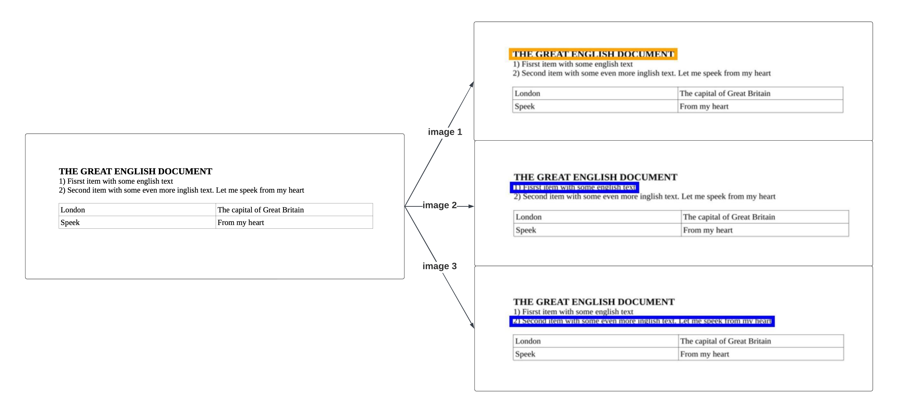
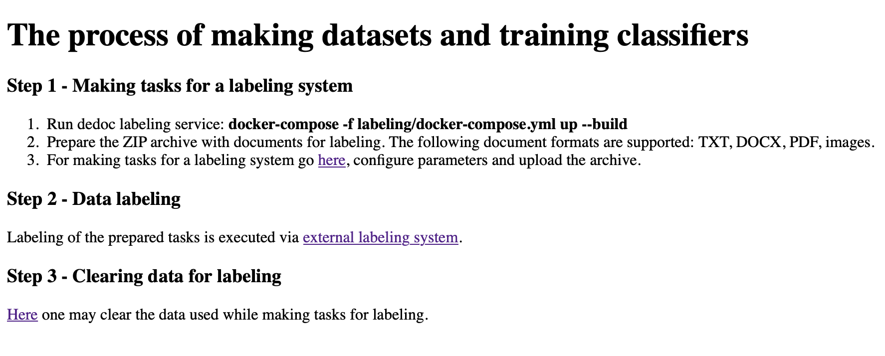
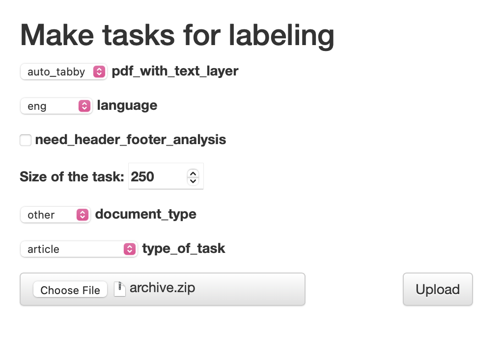
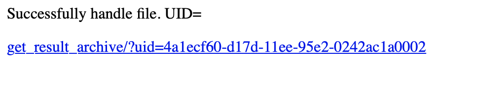
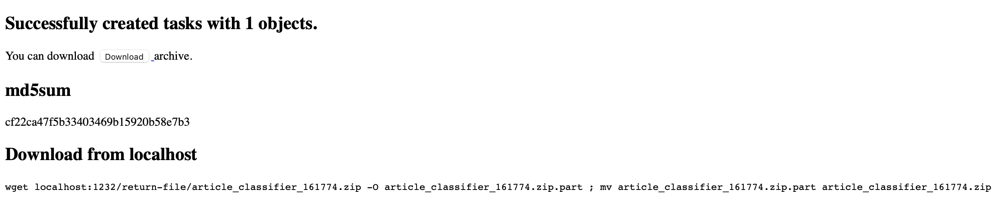
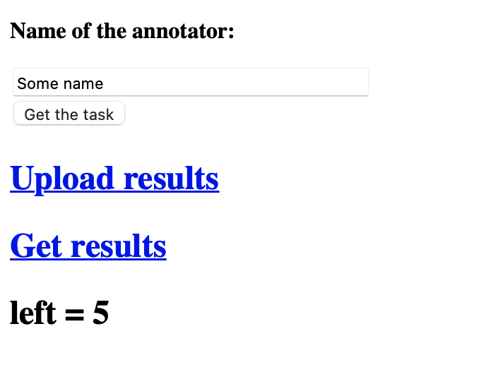

.. _add_structure_type_dataset_creation:

Dataset creation
================

In this section, the terms ``labeling`` and ``annotating`` are considered as equivalent.

Functionality, described below, is available after the whole source code was downloaded.
It can be done in different ways, e.g. downloading a `zip archive <https://github.com/ispras/dedoc/archive/refs/heads/master.zip>`_ or cloning the repository:

    .. code-block:: bash

        git clone https://github.com/ispras/dedoc

The utilities for dataset creation are located in the ``labeling`` directory of the project root.

.. note::
    In this tutorial, we suppose that the user has a Unix-based operating system with installed `python3.9+` and `Docker`.

We propose the following sequence of actions to create a training dataset for a new document domain:

    1. **Task description**. We consider a line classification task, therefore, in this step,
       it is necessary to enlist possible line types for the new domain.
       For this purpose, we use a file with task description ``manifest.pdf``, which can be shared with other annotators.

    2. **Tasker adding**. In this step, a new tasker is integrated into the labeling system.
       Taskers are utilized to make tasks for an `external labeling system <https://github.com/dronperminov/ImageClassifier>`_,
       where annotators will annotate the data.
       Taskers take as an input parsed document lines, make images for annotating and link lines with created images.
       As a result, annotated images are equivalent to annotated document lines.

    3. **Tasks creation**. To create tasks for annotating, one should run our labeling API and upload documents of a desired domain.
       Firstly, uploaded documents are parsed with Dedoc, secondly, tasks for annotating are created by a tasker according to the chosen task type.
       After this step, everything is ready for data annotation.

    4. **Data labeling**. The annotating process is mostly executed in the `external labeling system <https://github.com/dronperminov/ImageClassifier>`_,
       after which the results of several tasks labeling are merged into one dataset.

After dataset creation, the result can be uploaded into some cloud storage and used for training by a classifier.
Below we describe the steps in detail using the example domain of English scientific articles.

Make task description
---------------------

First of all, the list of line types should be determined.
Each type should be described in order to clearly understand how to annotate lines.
Some concrete examples of lines in documents can alleviate the line types description.
Also, it is necessary to choose a name for each line type: it is recommended to use names like for Python variables.
As a result, the file ``manifest.pdf`` should be made for a further work.

In our case, (we consider the domain of English scientific articles) ``manifest.pdf`` can look like this:
:download:`manifest.pdf <../../_static/add_new_structure_type/manifest.pdf>`.
This file contains listing and description of the main line types along with some visual examples.
We highlighted the following line types:

    * Title
    * Author
    * Affiliation
    * Named item
    * Caption
    * Reference
    * Raw text
    * Other

For each type, the description with examples is given. Additionally, some unclear cases are explained.

It is also recommended to save a file in editable format for fixing some mistakes or adding clarifications, for example, in ODT format.
The file may be empty, if there is only one annotator who knows the task perfectly.
Still, we recommend to describe the annotation rules just in case.

Add tasker
----------

Task creation consists mainly of two steps: document lines parsing by Dedoc and tasks creation based on the parsed lines.
Generally speaking, a single task consists of document lines with meta-information from Dedoc,
images for annotating linked to the document lines, and original documents uploaded for tasks creation.

Taskers are special classes for making tasks: they take as an input parsed document lines,
make images for annotating and link lines to the created images.
Linkage a line to an image allows annotators to see visual representation of a document during annotation process.
It is useful since a lot of information about line type is connected with line's appearance.

For example, if we need to label each line in a document image, tasker may generate images for labeling of each line like this:

In the step of adding a tasker, we can configure task creation.
It is better to work with the source code directly, similarly adding new code to the existing one.

1. Add auxiliary files ``manifest.pdf`` and ``config.json`` for a labeling system to the project resources: the subdirectory of the directory ``labeling/resources``.

      * The file ``manifest.pdf`` was made on the previous step.
      * The file ``config.json`` contains settings for our labeling system: which names for labels to use,
        which colors to use to draw bounding boxes for each line type, etc.
        The description of ``config.json`` is given in the README file `here <https://github.com/dronperminov/ImageClassifier>`_.
        The most important part of the file is ``labels`` key -- labels should have the same name as described in ``manifest.pdf``.
        The example of configuration file for article labeling: :download:`config.json <../../_static/add_new_structure_type/config.json>`

   In our example, let's call the subdirectory ``article``,
   then the files ``manifest.pdf`` and ``config.json`` should be located in ``labeling/resources/article``.

2. Add new tasker to the ``taskers`` dictionary in the ``labeling/train_dataset/api/api.py``:

    .. code-block:: python

       taskers = {
           "law_classifier": LineLabelTasker(
               path2lines=path2lines,
               path2docs=get_path_original_documents(config),
               manifest_path=os.path.join(train_resources_path, "law", "manifest.pdf"),
               config_path=os.path.join(train_resources_path, "law", "config.json"),
               tmp_dir=UPLOAD_FOLDER,
               progress_bar=progress_bar,
               item2label=lambda t: label2label_law.get(t["_metadata"]["hierarchy_level"]["line_type"], "raw_text"),
               config=config),
           "article_classifier": LineLabelTasker(
               path2lines=path2lines,
               path2docs=get_path_original_documents(config),
               manifest_path=os.path.join(train_resources_path, "article", "manifest.pdf"),
               config_path=os.path.join(train_resources_path, "article", "config.json"),
               tmp_dir=UPLOAD_FOLDER,
               progress_bar=progress_bar,
               item2label=lambda t: label2label_article.get(t["_metadata"]["hierarchy_level"]["line_type"], "raw_text"),
               config=config),
           ...
       }

    ``LineLabelTasker`` -- a default class for making tasks for each document line.
    It is not obligatory to use ``LineLabelTasker`` class,
    e.g. there is ``FilteredLineLabelTasker`` that creates tasks only for pages containing headers from the document ToC.
    It's possible to implement a custom tasker class for specific needs.

    Note: ``item2label`` parameter is used for mapping **Dedoc line types → line types for annotating prompt** (defined in the manifest).
    Dedoc saves classified document lines (:class:`~dedoc.data_structures.UnstructuredDocument`) with some detected types
    (according to the ``document_type`` API parameter) - these types may differ from the manifest types.
    Line types extracted by Dedoc may be used as initial prompt for annotators (e.g. when we already have a structure extractor and want to improve it).

    The mapping for our example with articles: suppose we have basic structure extractor for articles,
    and it returns the same types as defined in manifest -- dictionary contains identity mapping.

    .. code-block:: python

        label2label_article = {t: t for t in ("title", "named_item", "author", "affiliation", "caption", "reference", "raw_text", "other")}

    According to the initialization of the ``item2label`` parameter, if the detected line type wasn't found in the ``label2label_article`` dictionary,
    the line will be marked as ``raw_text`` by default. During annotation process, annotators will fix line types from ``raw_text`` into correct one.
    We choose ``raw_text`` as it's the most frequent type, but in other cases, another type can be used.

3. Add new type of the task to the API form. It should be done as tasks will be created via API (see the next step).

   Let's consider our example with articles.
   In the previous step, we added a new key "article_classifier" to the ``taskers`` dictionary.
   This key is a name of the "type_of_task" parameter in the API form.
   To add a new option for this parameter, "article_classifier" should be added to the enum of ``TrainDatasetParameters`` in the ``labeling/train_dataset/api/api.py``:

   .. code-block:: python

        @dataclass
        class TrainDatasetParameters(QueryParameters):
            type_of_task: Optional[str] = Form("law_classifier",
                                               enum=[
                                                   "law_classifier", "tz_classifier", "diploma_classifier", "header_classifier", "paragraph_classifier",
                                                   "tables_classifier", "article_classifier"
                                               ],
                                               description="Type of the task to create")
            task_size: Optional[str] = Form("250", description="Maximum number of images in one task")

   Also, "article_classifier" should be added to the HTML file ``labeling/train_dataset/api/web/form_input_archive.html``:

   .. code-block:: html

      

        <label>
            <select name="type_of_task">
                <option value="law_classifier" selected>law</option>
                <option value="tz_classifier">tz</option>
                <option value="diploma_classifier">diploma</option>
                <option value="header_classifier">header_classifier</option>
                <option value="paragraph_classifier">paragraph</option>
                <option value="tables_classifier">tables</option>
                <option value="article_classifier">article</option>
            </select> type_of_task
        </label>
      

Everything is ready for running our task-creation server.

Create tasks using API
----------------------

To run the application, go to the project root (``dedoc`` directory) and use the following command:

   .. code-block:: bash

        docker-compose -f labeling/docker-compose.yml up --build

Or you can run API from the ``labeling`` directory:

   .. code-block:: bash

        cd labeling
        docker-compose up --build

By default, API is available on ``localhost:1232``. Let's go to the page in a browser.

The main page contains a basic description of a task creation process.
According to the text, we need to create an archive with all files we want to include to the training dataset and annotate.
These files will be parsed by Dedoc (so their formats should be in the :ref:`table_formats`),
and then a tasker will create tasks (document formats should be supported by the chosen tasker).

.. note::
    At the current moment, taskers support images creation only for DOCX, TXT, PDF files and images.
    Please create `an issue <https://github.com/ispras/dedoc/issues>`_, if you need to make tasks for other document formats.

Let's go to the link in the third item of the first step:

Most of the configured parameters are related to the files parsing by Dedoc (:ref:`dedoc_api`).
New parameters:

    * **Size of the task** -- number of images to annotate in one task;
    * **type_of_task** -- tasker used for tasks creation.

For our example, we configure a language (English), type of the task (article).
Then we should form the archive and choose it in the form.
We upload :download:`archive.zip <../../_static/add_new_structure_type/archive.zip>` and press the ``Upload`` button.

The opened page contains link where ready tasks will appear after creation.
The user can run the creation of several tasks and save links to download ready tasks afterwards.

After tasks have been created, the link will lead on the following page:

After the archive with tasks was downloaded and unpacked, there are the following files inside:

    * ``original_documents.zip`` -- original files from the input documents for labeling;
    * several ``task_{uid}.zip`` -- files with tasks for one person to annotate (each file contains no more than ``Size of the task`` images;
    * ``task_manager.py``, ``formInput.html``, ``formResult.html`` -- are used to run a server for tasks distribution and gathering.

To run the server, go to the directory where these files are located and run the commands:

   .. code-block:: bash

        pip3 install Flask==2.0.3
        python3 task_manager.py

Then, go to ``localhost:3000`` and look at the page:

It isn't obligatory to run an application for tasks management. It may be useful when there are several annotators who label data.
If you don't want to run an application, annotate tasks from each file ``task_{uid}.zip`` and save the resulting ``json`` files.
They can be merged into one dataset using ``_merge_labeled()`` function of ``task_manager.py``.

In case of running application, tasks can be downloaded by each user using "Get the task" button.
After labeling (see the next step) the resulting ``json`` files are uploaded via "Upload results" button.
When all tasks are labeled, the information will appear that there's nothing to annotate.
The resulting merged dataset can be downloaded using "Get results" button.

Label dataset
-------------

In the previous step, we got several ``task_{uid}.zip`` -- these files are tasks for annotating.
To annotate the task, you should do the following:

1. Unpack the archive and go to the formed directory ``task_{uid}``.
2. Run the container with `labeling application <https://github.com/dronperminov/ImageClassifier>`_:

    .. code-block:: bash

        bash run.sh

3. Open ``localhost:5555`` in your browser:

    .. figure:: ../../_static/add_new_structure_type/labeling_page.png
        :width: 800

   The labeling process is quite intuitive, look to the README file of the `repository <https://github.com/dronperminov/ImageClassifier>`_ for more details.
   When all images in the task are labeled the download button will appear,
   and the labeling results will be stored in a ``json`` file like :download:`result.json <../../_static/add_new_structure_type/article_classifier_000000_UX6.json>`.

Merging resulting ``json`` files is described in the previous step.

The resulting dataset should contain:
    * ``labeled.json`` -- merged annotated ``json`` files with information about lines and their labels;
    * ``original_documents`` -- directory with original documents, i.e. the input documents for labeling, they may be useful for reprocessing by Dedoc of a newer version.
