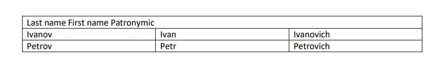

Creating Dedoc Document from basic data structures in code
==========================================================

Let's dig inside Dedoc data structures and build Dedoc document from scratch. During this tutorial you will learn:

* How to use data structures of Dedoc to store text, structure, tables, annotations, metadata, attachments
* What is inside the Dedoc unified output representation of document
* How document structure is defined

Raw document content is stored in :class:`~dedoc.data_structures.UnstructuredDocument`. This is de facto
a container with lists of data structures objects:

* list of :class:`~dedoc.data_structures.Table`
* list of text lines :class:`~dedoc.data_structures.LineWithMeta`
* list of attachments :class:`~dedoc.data_structures.AttachedFile`
* dict with metadata

Order of data structures in lists doesn't matter. All document hierarchy and structure is held inside the data structures.

LineWithMeta
------------

Basic block of Dedoc document is :class:`~dedoc.data_structures.LineWithMeta` (line with metadata):

.. literalinclude:: ../_static/code_examples/dedoc_creating_dedoc_document.py
    :language: python
    :lines: 8-9

Each document contains a hierarchy of its elements. For example, a header line should be on level higher than common
paragraph lines. Hierarchy level is produced by :ref:`dedoc_structure_extractors` and may vary depending on the type
of document. To specify hierarchy in our handmade document use :class:`~dedoc.data_structures.HierarchyLevel` class:

.. literalinclude:: ../_static/code_examples/dedoc_creating_dedoc_document.py
    :language: python
    :lines: 11-16

Hierarchy level compares by tuple (``level_1``, ``level_2``): lesser values are closer to the root of the tree.
``level_1`` is primary hierarchy dimension that defines type of line:

* `root` is ``level_1`` = 0
* `header` is ``level_1`` = 1

etc.

``level_2`` is a dimension through lines of equal type such as nested lists:

* `1.` is ``level_2`` = 1
* `1.1` is ``level_2`` = 2
* `2.6` is ``level_2`` = 2
* `3.4.5.1` is ``level_2`` = 4

Some parts of the document (for example title) may take more than one line. To union them set ``can_be_multiline``
to `True` and then and copy ``level_1``, ``level_2`` and ``line_type`` from the first line to others.

Define metadata with :class:`~dedoc.data_structures.LineMetadata`:

.. literalinclude:: ../_static/code_examples/dedoc_creating_dedoc_document.py
    :language: python
    :lines: 18

Also there is an option to add some :ref:`annotations`:

.. literalinclude:: ../_static/code_examples/dedoc_creating_dedoc_document.py
    :language: python
    :lines: 19

Now you can create new :class:`~dedoc.data_structures.LineMetadata` with hierarchy level, metadata and annotations:

.. literalinclude:: ../_static/code_examples/dedoc_creating_dedoc_document.py
    :language: python
    :lines: 21

A few words about ``tag_heirarchy_level`` parameter: some readers extracts information about hierarchy
directly from tags in document. Dedoc store this information as :class:`~dedoc.data_structures.HierarchyLevel` object
at ``tag_heirarchy_level`` property of :class:`~dedoc.data_structures.LineMetadata`. List of readers that
create ``tag_hierarchy_level``:

* :class:`~dedoc.readers.DocxReader`
* :class:`~dedoc.readers.EmailReader`
* :class:`~dedoc.readers.HtmlReader`
* :class:`~dedoc.readers.JsonReader`
* :class:`~dedoc.readers.PdfImageReader`
* :class:`~dedoc.readers.PdfImageReader`
* :class:`~dedoc.readers.PdfTabbyReader`
* :class:`~dedoc.readers.RawTextReader`

Table
-----

Imagine you have table like this:

.. literalinclude:: ../_static/code_examples/dedoc_creating_dedoc_document.py
    :language: python
    :lines: 23-26

Main block of tables is :class:`~dedoc.data_structures.CellWithMeta`. To create table, you should
make list of lists of :class:`~dedoc.data_structures.CellWithMeta`.

.. literalinclude:: ../_static/code_examples/dedoc_creating_dedoc_document.py
    :language: python
    :lines: 28-35

Table also has some metadata, let's assume that our table is on the first page.
Use :class:`~dedoc.data_structures.TableMetadata`:

.. literalinclude:: ../_static/code_examples/dedoc_creating_dedoc_document.py
    :language: python
    :lines: 37

Finally, create :class:`~dedoc.data_structures.Table`:

.. literalinclude:: ../_static/code_examples/dedoc_creating_dedoc_document.py
    :language: python
    :lines: 38

To place table to the specific place in hierarchy create :class:`~dedoc.data_structures.LineWithMeta`
with :class:`~dedoc.data_structures.TableAnnotation`:

.. literalinclude:: ../_static/code_examples/dedoc_creating_dedoc_document.py
    :language: python
    :lines: 40-50

Let's try to construct more complicated table such this one:

First steps is almost the same as for previous table:

.. literalinclude:: ../_static/code_examples/dedoc_creating_dedoc_document.py
    :language: python
    :lines: 52-62

Then change ``colspan`` parameter of the first cell of first row to 3 like in HTML format.
Set ``invisible`` to `True` on the other two cells of the row:

.. literalinclude:: ../_static/code_examples/dedoc_creating_dedoc_document.py
    :language: python
    :lines: 64-66

Table is well done!

.. literalinclude:: ../_static/code_examples/dedoc_creating_dedoc_document.py
    :language: python
    :lines: 58-69

Add to :class:`~dedoc.data_structures.LineWithMeta`:

.. literalinclude:: ../_static/code_examples/dedoc_creating_dedoc_document.py
    :language: python
    :lines: 71-81

AttachedFile
------------

Also we can attach some files:

.. literalinclude:: ../_static/code_examples/dedoc_creating_dedoc_document.py
    :language: python
    :lines: 83

Following the example of tables:

.. literalinclude:: ../_static/code_examples/dedoc_creating_dedoc_document.py
    :language: python
    :lines: 85-95

Unstructured Document
---------------------

Now we are ready to create :class:`~dedoc.data_structures.UnstructuredDocument` object:

.. literalinclude:: ../_static/code_examples/dedoc_creating_dedoc_document.py
    :language: python
    :lines: 97-101

Parsed Document
---------------

There are several ways how the structure of document can be represented. In this tutorial
we will utilize :class:`~dedoc.structure_constructors.TreeConstructor` that
returns document tree from unstructured document. However, we should add some file
metadata to create tree representation. File metadata is usually extracted by Dedoc but because we are
building document from scratch we have to add it by ourselves.

.. literalinclude:: ../_static/code_examples/dedoc_creating_dedoc_document.py
    :language: python
    :lines: 103-111

.. literalinclude:: ../_static/code_examples/dedoc_creating_dedoc_document.py
    :language: python
    :lines: 113-114

To get the tree as a dict:

.. literalinclude:: ../_static/code_examples/dedoc_creating_dedoc_document.py
    :language: python
    :lines: 116

Great job! You just created from scratch your first document in Dedoc format!
