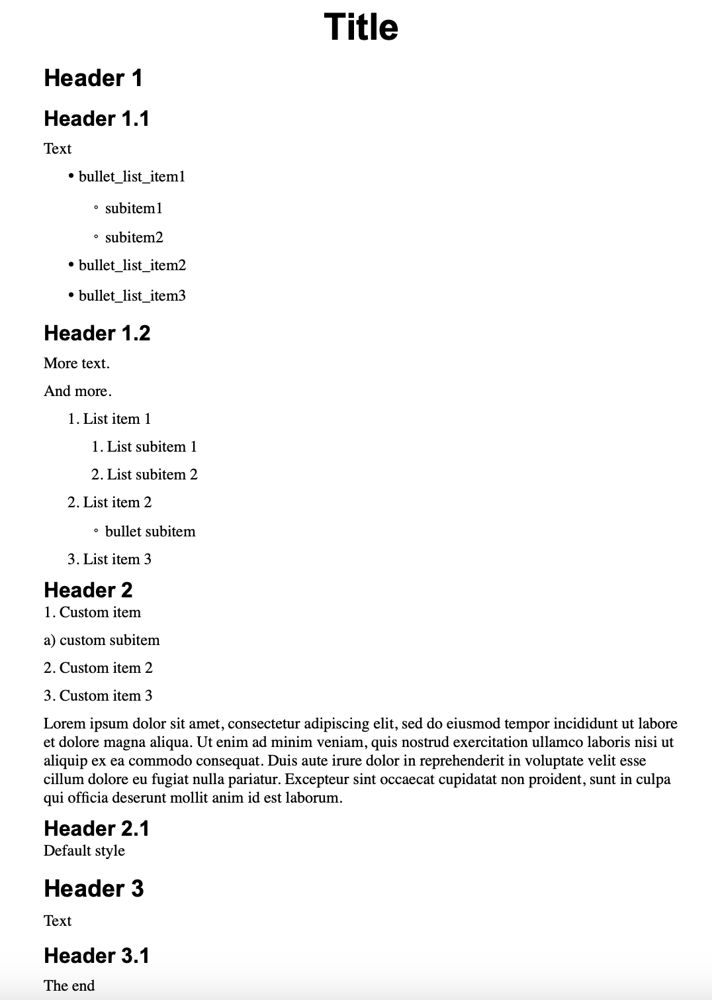
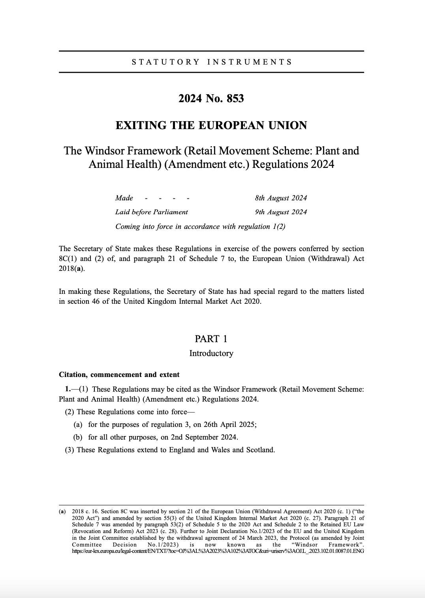

.. _using_patterns:

Configure structure extraction using patterns
=============================================

It is possible to configure structure type in Dedoc: option ``document_type`` in the ``parameters`` dictionary
(:ref:`api_parameters`, :ref:`structure_type_parameters`).
The default structure type (when ``document_type="other"``, see :ref:`other_structure`) allows to get a basic document structure which is fixed.
If you want to change this structure, e.g. names of line types (nodes) or their levels in the tree hierarchy, you can use structure patterns.

Use patterns in Dedoc library
-----------------------------

If you use Dedoc as a library, you can use existing pattern classes :ref:`dedoc_structure_extractors_patterns`
or implement your own custom pattern based on :class:`~dedoc.structure_extractors.patterns.abstract_pattern.AbstractPattern`.

Let's see some examples. First of all, we enlist all the required imports:

.. literalinclude:: ../_static/code_examples/dedoc_using_patterns_tutorial.py
    :language: python
    :lines: 1-13

Using information from readers
~~~~~~~~~~~~~~~~~~~~~~~~~~~~~~

Assume we need to parse file :download:`with_tags.docx <../_static/code_examples/test_dir/with_tags.docx>`, which looks like follows:

.. _docx_with_tags_image:

    DOCX document example

In this document, there are headers that are marked as heading lines by user, as well as headers highlighted by formatting
(bold font of a larger size, e.g. Header 2 or Header 2.1).
Also, there are automatic lists (list items, bullet list items) and raw text list items (custom list items).

Let's read the document by :class:`~dedoc.readers.DocxReader` and see a result:

.. literalinclude:: ../_static/code_examples/dedoc_using_patterns_tutorial.py
    :language: python
    :lines: 18-28

.. code-block:: text

    Document lines

    LineWithMeta(Title, tagHL=(1, 1, 'header'), HL=None)
    LineWithMeta(Header 1, tagHL=(None, None, 'unknown'), HL=None)
    LineWithMeta(Header 1.1, tagHL=(1, 3, 'header'), HL=None)
    LineWithMeta(Text, tagHL=(None, None, 'unknown'), HL=None)
    LineWithMeta(·	bullet_list_item1, tagHL=(2, 1, 'list_item'), HL=None)
    LineWithMeta(◦	subitem1, tagHL=(2, 1, 'list_item'), HL=None)
    LineWithMeta(◦	subitem2, tagHL=(2, 1, 'list_item'), HL=None)
    ...
    LineWithMeta(Header 2, tagHL=(None, None, 'unknown'), HL=None)
    LineWithMeta(1. Custom item, tagHL=(None, None, 'unknown'), HL=None)
    LineWithMeta(a) custom subitem, tagHL=(None, None, 'unknown'), HL=None)
    LineWithMeta(2. Custom item 2, tagHL=(None, None, 'unknown'), HL=None)
    LineWithMeta(3. Custom item 3, tagHL=(None, None, 'unknown'), HL=None)
    ...

For each line, its text and hierarchy level information is printed (``tagHL``, ``HL``).

.. seealso::

    * Documentation of classes :class:`~dedoc.data_structures.LineWithMeta`, :class:`~dedoc.data_structures.LineMetadata`, :class:`~dedoc.data_structures.HierarchyLevel` may be helpful;
    * :ref:`add_structure_type_hierarchy_level` may be useful for understanding :class:`~dedoc.data_structures.HierarchyLevel`.
    * :ref:`readers_line_types` can be helpful to find out which readers are able to extract certain types of lines.

As we see, the reader filled the ``metadata.tag_hierarchy_level`` field (``tagHL``):

    * some lines have types ``header`` or ``list_item`` and non-empty values of ``level_1`` and ``level_2``;
    * some lines have ``unknown`` type and empty values of levels - it means that the reader couldn't extract any information for these lines.

To extract structure and construct a document tree, we need:

    1. add metadata to the document (call metadata extractor);
    2. fill ``metadata.hierarchy_level`` (call structure extractor);
    3. construct a document tree (call structure constructor).

Let's use information from :class:`~dedoc.readers.DocxReader` about headers and list items during structure extraction step.
For this purpose, we initialize :class:`~dedoc.structure_extractors.patterns.TagHeaderPattern` and
:class:`~dedoc.structure_extractors.patterns.TagListPattern` classes.
These patterns are given to the :meth:`~dedoc.structure_extractors.DefaultStructureExtractor.extract` method,
which applies patterns if lines match them, else line becomes simple raw text line.

.. literalinclude:: ../_static/code_examples/dedoc_using_patterns_tutorial.py
    :language: python
    :lines: 30-37

Let's see the resulting tree. In the code below we use an auxiliary function to convert :class:`~dedoc.api.schema.ParsedDocument`
to the HTML representation and print it:

.. literalinclude:: ../_static/code_examples/dedoc_using_patterns_tutorial.py
    :language: python
    :lines: 38-44

.. code-block:: text

    Document tree
    **** id = 0 ; type = root

         **Title** id = 0.0 ; type = custom_header

             **Header 1** id = 0.0.0 ; type = raw_text

             **Header 1.1** id = 0.0.1 ; type = custom_header

                 Text  id = 0.0.1.0 ; type = raw_text

                 · bullet_list_item1  id = 0.0.1.1 ; type = custom_list

                 ◦ subitem1  id = 0.0.1.2 ; type = custom_list

                 ◦ subitem2  id = 0.0.1.3 ; type = custom_list

                 ...

                     **Header 2
                    **1\. Custom item
                    a) custom subitem
                    2\. Custom item 2
                    3\. Custom item 3
                 ... id = 0.0.2.4.0 ; type = raw_text
                 ...

As wee see, lines with types ``header`` and ``list_item`` from ``tagHL`` became ``custom_header`` and ``custom_list`` according to the patterns settings.
But `Header 2` and custom items became ``raw_text`` and were merged into one node (``can_be_multiline=True`` for ``raw_text`` lines).

Using regular expressions
~~~~~~~~~~~~~~~~~~~~~~~~~

In this section, we'll transform `Header 2` and custom items to the lines with types ``header`` and ``list_item``.

First of all, we introduce an auxiliary function ``print_document_tree`` to avoid code duplication:

.. literalinclude:: ../_static/code_examples/dedoc_using_patterns_tutorial.py
    :language: python
    :lines: 47-51

To handle lines basing on their text only (without ``tagHL`` information), we can use patterns based on regular expressions.
For this purpose, we can use class :class:`~dedoc.structure_extractors.patterns.RegexpPattern` and classes that are based on it,
e.g. :class:`~dedoc.structure_extractors.patterns.DottedListPattern` and :class:`~dedoc.structure_extractors.patterns.LetterListPattern`.

.. literalinclude:: ../_static/code_examples/dedoc_using_patterns_tutorial.py
    :language: python
    :lines: 54-62

.. code-block:: text

    Document tree
    **** id = 0 ; type = root

         **Title** id = 0.0 ; type = custom_header

         **Header 1** id = 0.1 ; type = custom_header

             **Header 1.1** id = 0.1.0 ; type = custom_header

                 Text  id = 0.1.0.0 ; type = raw_text

                 · bullet_list_item1  id = 0.1.0.1 ; type = custom_list

                 ◦ subitem1  id = 0.1.0.2 ; type = custom_list

                 ◦ subitem2  id = 0.1.0.3 ; type = custom_list

    ...

         **Header 2
        ********** id = 0.2 ; type = custom_header

             1\. Custom item
             id = 0.2.0 ; type = custom_list

                 a) custom subitem
                 id = 0.2.0.0 ; type = custom_list

             2\. Custom item 2
             id = 0.2.1 ; type = custom_list

             3\. Custom item 3
             id = 0.2.2 ; type = custom_list
    ...

In this case, `Header 2` and custom items became ``custom_header`` and ``custom_list`` as well as `Header 1` and bullet list items.

.. note::

    The order of the patterns is important: if you place regexp patterns before tag patterns, then tag patterns will be ignored.
    It happens because some lines match both regexp and tag patterns.

.. seealso::

    You can see the full list of patterns with their descriptions here: :ref:`dedoc_structure_extractors_patterns`.

The next section contains a more real-life example.

Practical example: get structured PDF
~~~~~~~~~~~~~~~~~~~~~~~~~~~~~~~~~~~~~

Assume we need to parse file :download:`law.pdf <../_static/code_examples/test_dir/law.pdf>`, the first page of which looks like follows:

.. _pdf_law_image:

    PDF document example

This document has a certain structure with parts, chapters and numbered lists.
Let's read the document using :class:`~dedoc.readers.PdfTabbyReader` and see the result:

.. literalinclude:: ../_static/code_examples/dedoc_using_patterns_tutorial.py
    :language: python
    :lines: 66-74

.. code-block:: text

    Document lines

    LineWithLocation(S T A T U T O R Y I N S T R U M E N T S, tagHL=(None, None, 'unknown'), HL=None)
    LineWithLocation(2024 No. 853, tagHL=(None, None, 'unknown'), HL=None)
    LineWithLocation(EXITING THE EUROPEAN UNION, tagHL=(None, None, 'unknown'), HL=None)
    LineWithLocation(The Windsor Framework (Retail Movement Scheme: Plant and, tagHL=(None, None, 'unknown'), HL=None)
    LineWithLocation(Animal Health) (Amendment etc.) Regulations 2024, tagHL=(None, None, 'unknown'), HL=None)
    LineWithLocation(- - - - Made 8th August 2024, tagHL=(None, None, 'unknown'), HL=None)
    LineWithLocation(Laid before Parliament 9th August 2024, tagHL=(None, None, 'unknown'), HL=None)
    LineWithLocation(Coming into force in accordance with regulation 1(2), tagHL=(None, None, 'unknown'), HL=None)
    LineWithLocation(The Secretary of State makes these Regulations in exercise of ..., tagHL=(None, None, 'unknown'), HL=None)
    LineWithLocation(8C(1) and (2) of, and paragraph 21 of Schedule 7 to, the Europ..., tagHL=(None, None, 'unknown'), HL=None)

Here we consider class ``LineWithLocation`` almost the same as :class:`~dedoc.data_structures.LineWithMeta`.
As we see, ``tagHL=(None, None, 'unknown')`` for each line:
this means that the reader couldn't extract any useful information about lines types and levels.
So, :class:`~dedoc.structure_extractors.patterns.TagHeaderPattern` and
:class:`~dedoc.structure_extractors.patterns.TagListPattern` are useless in this case.

.. note::

    :class:`~dedoc.readers.PdfTabbyReader` is able to extract information about headers and list items from PDF if possible.
    But, in reality, most PDF documents don't contain information about headers and list items.

Let's use regexp-based patterns to extract a simple structure and see the result:

.. literalinclude:: ../_static/code_examples/dedoc_using_patterns_tutorial.py
    :language: python
    :lines: 76-83

.. code-block:: text

    Document tree
    **** id = 0 ; type = root

         S T A T U T O R Y I N S T R U M E N T S
        **2024 No. 853
        EXITING THE EUROPEAN UNION**
        The Windsor Framework (Retail Movement Scheme: Plant and
        Animal Health) (Amendment etc.) Regulations 2024
        _-_ \- - _\- Made 8th August 2024
        Laid before Parliament 9th August 2024
        Coming into force in accordance with regulation 1(2)_
        The Secretary of State makes these Regulations in exercise of the powers conferred by section
        8C(1) and (2) of, and paragraph 21 of Schedule 7 to, the European Union (Withdrawal) Act
        2018(a).
        In making these Regulations, the Secretary of State has had special regard to the matters listed
        in section 46 of the United Kingdom Internal Market Act 2020.
         id = 0.0 ; type = raw_text

         PART 1
         id = 0.1 ; type = part

             Introductory
            **Citation, commencement and extent**
             id = 0.1.0 ; type = raw_text

             **1.—(1)** These Regulations may be cited as the Windsor Framework (Retail Movement Scheme:
             id = 0.1.1 ; type = point

                 Plant and Animal Health) (Amendment etc.) Regulations 2024.
                 id = 0.1.1.0 ; type = raw_text

                 (2) These Regulations come into force—
                 id = 0.1.1.1 ; type = item

                     (a) for the purposes of regulation 3, on 26th April 2025;
                     id = 0.1.1.1.0 ; type = sub_item

                     (b) for all other purposes, on 2nd September 2024.
                     id = 0.1.1.1.1 ; type = sub_item

        ...

As we see, parts and list items were extracted successfully, but headers highlighted in bold became raw text lines.
Information about bold font can be found in the ``annotations`` attribute of :class:`~dedoc.data_structures.LineWithMeta`:

.. literalinclude:: ../_static/code_examples/dedoc_using_patterns_tutorial.py
    :language: python
    :lines: 86-88

In the result below, some lines contain ``Bold`` annotation among others.

.. code-block:: text

    LineWithLocation(S T A T U T O R Y I N S T R U M E N T S, tagHL=(None, None, 'unknown'), HL=(None, None, 'raw_text')) [Indentation(...), Spacing(...), Bounding box(...), Size(...), Style(...), Bounding box(...), Size(...), Style(...), Bounding box(...), Size(...), Style(...), Bounding box(...), Size(...), Style(...), Bounding box(...), Size(...), Style(...), Bounding box(...), Size(...), Style(...), Bounding box(...), Size(...), Style(...), Bounding box(...), Size(...), Style(...), Bounding box(...), Size(...), Style(...), Bounding box(...), Size(...), Style(...), Bounding box(...), Size(...), Style(...), Bounding box(...), Size(...), Style(...), Bounding box(...), Size(...), Style(...), Bounding box(...), Size(...), Style(...), Bounding box(...), Size(...), Style(...), Bounding box(...), Size(...), Style(...), Bounding box(...), Size(...), Style(...), Bounding box(...), Size(...), Style(...), Bounding box(...), Size(...), Style(...), Bounding box(...), Size(...), Style(...), Indentation(...), Spacing(...), Bounding box(...), Size(...), Style(...), Bold(...), Bounding box(...), Size(...), Style(...), Bold(...), Bounding box(...), Size(...), Style(...), Bold(...), Indentation(...), Spacing(...), Bounding box(...), Size(...), Style(...), Bold(...), Bounding box(...), Size(...), Style(...), Bold(...), Bounding box(...), Size(...), Style(...), Bold(...), Bounding box(...), Size(...), Style(...), Bold(...), Indentation(...), Spacing(...), Bounding box(...), Size(...), Style(...), Bounding box(...), Size(...), Style(...), Bounding box(...), Size(...), Style(...), Bounding box(...), Size(...), Style(...), Bounding box(...), Size(...), Style(...), Bounding box(...), Size(...), Style(...), Bounding box(...), Size(...), Style(...), Bounding box(...), Size(...), Style(...), Indentation(...), Spacing(...), Bounding box(...), Size(...), Style(...), Bounding box(...), Size(...), Style(...), Bounding box(...), Size(...), Style(...), Bounding box(...), Size(...), Style(...), Bounding box(...), Size(...), Style(...), Bounding box(...), Size(...), Style(...), Indentation(...), Spacing(...), Bounding box(...), Size(...), Style(...), Italic(...), Bounding box(...), Size(...), Style(...), Bounding box(...), Size(...), Style(...), Bounding box(...), Size(...), Style(...), Italic(...), Bounding box(...), Size(...), Style(...), Italic(...), Bounding box(...), Size(...), Style(...), Italic(...), Bounding box(...), Size(...), Style(...), Italic(...), Bounding box(...), Size(...), Style(...), Italic(...), Indentation(...), Spacing(...), Bounding box(...), Size(...), Style(...), Italic(...), Bounding box(...), Size(...), Style(...), Italic(...), Bounding box(...), Size(...), Style(...), Italic(...), Bounding box(...), Size(...), Style(...), Italic(...), Bounding box(...), Size(...), Style(...), Italic(...), Bounding box(...), Size(...), Style(...), Italic(...), Indentation(...), Spacing(...), Bounding box(...), Size(...), Style(...), Italic(...), Bounding box(...), Size(...), Style(...), Italic(...), Bounding box(...), Size(...), Style(...), Italic(...), Bounding box(...), Size(...), Style(...), Italic(...), Bounding box(...), Size(...), Style(...), Italic(...), Bounding box(...), Size(...), Style(...), Italic(...), Bounding box(...), Size(...), Style(...), Italic(...), Bounding box(...), Size(...), Style(...), Italic(...), Indentation(...), Spacing(...), Bounding box(...), Size(...), Style(...), Bounding box(...), Size(...), Style(...), Bounding box(...), Size(...), Style(...), Bounding box(...), Size(...), Style(...), Bounding box(...), Size(...), Style(...), Bounding box(...), Size(...), Style(...), Bounding box(...), Size(...), Style(...), Bounding box(...), Size(...), Style(...), Bounding box(...), Size(...), Style(...), Bounding box(...), Size(...), Style(...), Bounding box(...), Size(...), Style(...), Bounding box(...), Size(...), Style(...), Bounding box(...), Size(...), Style(...), Bounding box(...), Size(...), Style(...), Bounding box(...), Size(...), Style(...), Indentation(...), Spacing(...), Bounding box(...), Size(...), Style(...), Bounding box(...), Size(...), Style(...), Bounding box(...), Size(...), Style(...), Bounding box(...), Size(...), Style(...), Bounding box(...), Size(...), Style(...), Bounding box(...), Size(...), Style(...), Bounding box(...), Size(...), Style(...), Bounding box(...), Size(...), Style(...), Bounding box(...), Size(...), Style(...), Bounding box(...), Size(...), Style(...), Bounding box(...), Size(...), Style(...), Bounding box(...), Size(...), Style(...), Bounding box(...), Size(...), Style(...), Bounding box(...), Size(...), Style(...), Bounding box(...), Size(...), Style(...), Bounding box(...), Size(...), Style(...), Indentation(...), Spacing(...), Bounding box(...), Size(...), Style(...), Indentation(...), Spacing(...), Bounding box(...), Size(...), Style(...), Bounding box(...), Size(...), Style(...), Bounding box(...), Size(...), Style(...), Bounding box(...), Size(...), Style(...), Bounding box(...), Size(...), Style(...), Bounding box(...), Size(...), Style(...), Bounding box(...), Size(...), Style(...), Bounding box(...), Size(...), Style(...), Bounding box(...), Size(...), Style(...), Bounding box(...), Size(...), Style(...), Bounding box(...), Size(...), Style(...), Bounding box(...), Size(...), Style(...), Bounding box(...), Size(...), Style(...), Bounding box(...), Size(...), Style(...), Bounding box(...), Size(...), Style(...), Bounding box(...), Size(...), Style(...), Indentation(...), Spacing(...), Bounding box(...), Size(...), Style(...), Bounding box(...), Size(...), Style(...), Bounding box(...), Size(...), Style(...), Bounding box(...), Size(...), Style(...), Bounding box(...), Size(...), Style(...), Bounding box(...), Size(...), Style(...), Bounding box(...), Size(...), Style(...), Bounding box(...), Size(...), Style(...), Bounding box(...), Size(...), Style(...), Bounding box(...), Size(...), Style(...), Bounding box(...), Size(...), Style(...)]
    LineWithLocation(2024 No. 853, tagHL=(None, None, 'unknown'), HL=(None, None, 'raw_text')) [Indentation(...), Spacing(...), Bounding box(...), Size(...), Style(...), Bold(...), Bounding box(...), Size(...), Style(...), Bold(...), Bounding box(...), Size(...), Style(...), Bold(...)]
    LineWithLocation(EXITING THE EUROPEAN UNION, tagHL=(None, None, 'unknown'), HL=(None, None, 'raw_text')) [Indentation(...), Spacing(...), Bounding box(...), Size(...), Style(...), Bold(...), Bounding box(...), Size(...), Style(...), Bold(...), Bounding box(...), Size(...), Style(...), Bold(...), Bounding box(...), Size(...), Style(...), Bold(...)]
    LineWithLocation(The Windsor Framework (Retail Movement Scheme: Plant and, tagHL=(None, None, 'unknown'), HL=(None, None, 'raw_text')) [Indentation(...), Spacing(...), Bounding box(...), Size(...), Style(...), Bounding box(...), Size(...), Style(...), Bounding box(...), Size(...), Style(...), Bounding box(...), Size(...), Style(...), Bounding box(...), Size(...), Style(...), Bounding box(...), Size(...), Style(...), Bounding box(...), Size(...), Style(...), Bounding box(...), Size(...), Style(...)]
    LineWithLocation(Animal Health) (Amendment etc.) Regulations 2024, tagHL=(None, None, 'unknown'), HL=(None, None, 'raw_text')) [Indentation(...), Spacing(...), Bounding box(...), Size(...), Style(...), Bounding box(...), Size(...), Style(...), Bounding box(...), Size(...), Style(...), Bounding box(...), Size(...), Style(...), Bounding box(...), Size(...), Style(...), Bounding box(...), Size(...), Style(...)]
    LineWithLocation(- - - - Made 8th August 2024, tagHL=(None, None, 'unknown'), HL=(None, None, 'raw_text')) [Indentation(...), Spacing(...), Bounding box(...), Size(...), Style(...), Italic(...), Bounding box(...), Size(...), Style(...), Bounding box(...), Size(...), Style(...), Bounding box(...), Size(...), Style(...), Italic(...), Bounding box(...), Size(...), Style(...), Italic(...), Bounding box(...), Size(...), Style(...), Italic(...), Bounding box(...), Size(...), Style(...), Italic(...), Bounding box(...), Size(...), Style(...), Italic(...)]
    LineWithLocation(Laid before Parliament 9th August 2024, tagHL=(None, None, 'unknown'), HL=(None, None, 'raw_text')) [Indentation(...), Spacing(...), Bounding box(...), Size(...), Style(...), Italic(...), Bounding box(...), Size(...), Style(...), Italic(...), Bounding box(...), Size(...), Style(...), Italic(...), Bounding box(...), Size(...), Style(...), Italic(...), Bounding box(...), Size(...), Style(...), Italic(...), Bounding box(...), Size(...), Style(...), Italic(...)]
    LineWithLocation(Coming into force in accordance with regulation 1(2), tagHL=(None, None, 'unknown'), HL=(None, None, 'raw_text')) [Indentation(...), Spacing(...), Bounding box(...), Size(...), Style(...), Italic(...), Bounding box(...), Size(...), Style(...), Italic(...), Bounding box(...), Size(...), Style(...), Italic(...), Bounding box(...), Size(...), Style(...), Italic(...), Bounding box(...), Size(...), Style(...), Italic(...), Bounding box(...), Size(...), Style(...), Italic(...), Bounding box(...), Size(...), Style(...), Italic(...), Bounding box(...), Size(...), Style(...), Italic(...)]
    LineWithLocation(The Secretary of State makes these Regulations in exercise of ..., tagHL=(None, None, 'unknown'), HL=(None, None, 'raw_text')) [Indentation(...), Spacing(...), Bounding box(...), Size(...), Style(...), Bounding box(...), Size(...), Style(...), Bounding box(...), Size(...), Style(...), Bounding box(...), Size(...), Style(...), Bounding box(...), Size(...), Style(...), Bounding box(...), Size(...), Style(...), Bounding box(...), Size(...), Style(...), Bounding box(...), Size(...), Style(...), Bounding box(...), Size(...), Style(...), Bounding box(...), Size(...), Style(...), Bounding box(...), Size(...), Style(...), Bounding box(...), Size(...), Style(...), Bounding box(...), Size(...), Style(...), Bounding box(...), Size(...), Style(...), Bounding box(...), Size(...), Style(...)]
    LineWithLocation(8C(1) and (2) of, and paragraph 21 of Schedule 7 to, the Europ..., tagHL=(None, None, 'unknown'), HL=(None, None, 'raw_text')) [Indentation(...), Spacing(...), Bounding box(...), Size(...), Style(...), Bounding box(...), Size(...), Style(...), Bounding box(...), Size(...), Style(...), Bounding box(...), Size(...), Style(...), Bounding box(...), Size(...), Style(...), Bounding box(...), Size(...), Style(...), Bounding box(...), Size(...), Style(...), Bounding box(...), Size(...), Style(...), Bounding box(...), Size(...), Style(...), Bounding box(...), Size(...), Style(...), Bounding box(...), Size(...), Style(...), Bounding box(...), Size(...), Style(...), Bounding box(...), Size(...), Style(...), Bounding box(...), Size(...), Style(...), Bounding box(...), Size(...), Style(...), Bounding box(...), Size(...), Style(...)]

.. seealso::

    * More information about each type of annotation, e.g. :class:`~dedoc.data_structures.BoldAnnotation` can be found here: :ref:`annotations`.
    * :ref:`readers_annotations` can be helpful to find out which readers are able to extract certain types of annotations.

Let's use the information about bold font for titles and headers detection.
There is no such a pattern in Dedoc, that uses lines annotations.
Don't worry! We can write them from scratch.

Each pattern should be based on the class :class:`~dedoc.structure_extractors.patterns.abstract_pattern.AbstractPattern`
and implement all its methods:

* :meth:`~dedoc.structure_extractors.patterns.abstract_pattern.AbstractPattern.match` to check if the line matches the pattern;
* :meth:`~dedoc.structure_extractors.patterns.abstract_pattern.AbstractPattern.get_hierarchy_level` to get \
    line type (``line_type``) and hierarchy levels (``level_1``, ``level_2``), and if it can be merged with other lines (``can_be_multiline``);
* ``_name`` attribute to differentiate this pattern from others.

.. code-block:: python

    from dedoc.structure_extractors.patterns.abstract_pattern import AbstractPattern

    class CustomPattern(AbstractPattern):
        _name = "custom_pattern"

        def match(self, line: LineWithMeta) -> bool:
            pass

        def get_hierarchy_level(self, line: LineWithMeta) -> HierarchyLevel:
            pass

.. seealso::

    * Documentation of classes :class:`~dedoc.structure_extractors.patterns.abstract_pattern.AbstractPattern` and :class:`~dedoc.data_structures.HierarchyLevel` may be helpful;
    * :ref:`add_structure_type_hierarchy_level` may be useful for understanding :class:`~dedoc.data_structures.HierarchyLevel`;
    * You can also see the source code of other patterns through :ref:`dedoc_structure_extractors_patterns`.

The code below shows implementation of two patterns for titles and sub-headers:

.. literalinclude:: ../_static/code_examples/dedoc_using_patterns_tutorial.py
    :language: python
    :lines: 91-110

Now we can use all the patterns together and see the resulting document tree.

.. literalinclude:: ../_static/code_examples/dedoc_using_patterns_tutorial.py
    :language: python
    :lines: 113-122

.. code-block:: text

    Document tree
    **** id = 0 ; type = root

         S T A T U T O R Y I N S T R U M E N T S
        **_**<**i> <**/**i> <**i**>_ >**>**__<** i**>_**_____________________________ id = 0.0 ; type = title

             **2024 No. 853**
             id = 0.0.0 ; type = sub_header

         **EXITING THE EUROPEAN UNION**
         id = 0.1 ; type = title

             The Windsor Framework (Retail Movement Scheme: Plant and
            Animal Health) (Amendment etc.) Regulations 2024
            _-_ \- - _\- Made 8th August 2024
            Laid before Parliament 9th August 2024
            Coming into force in accordance with regulation 1(2)_
            The Secretary of State makes these Regulations in exercise of the powers conferred by section
            8C(1) and (2) of, and paragraph 21 of Schedule 7 to, the European Union (Withdrawal) Act
            2018(a).
            In making these Regulations, the Secretary of State has had special regard to the matters listed
            in section 46 of the United Kingdom Internal Market Act 2020.
             id = 0.1.0 ; type = raw_text

         PART 1
         id = 0.2 ; type = part

             Introductory
            **Citation, commencement and extent**
             id = 0.2.0 ; type = sub_header

                 **1.—(1)** These Regulations may be cited as the Windsor Framework (Retail Movement Scheme:
                 id = 0.2.0.0 ; type = point

                     Plant and Animal Health) (Amendment etc.) Regulations 2024.
                     id = 0.2.0.0.0 ; type = raw_text

                     (2) These Regulations come into force—
                     id = 0.2.0.0.1 ; type = item

                         (a) for the purposes of regulation 3, on 26th April 2025;
                         id = 0.2.0.0.1.0 ; type = sub_item

                         (b) for all other purposes, on 2nd September 2024.
                         id = 0.2.0.0.1.1 ; type = sub_item

As a result, we extracted basic information using simple regular expressions and information about document formatting.
One can come up with more complicated patterns to enrich this document representation by new line types and node depths.

Conclusions
~~~~~~~~~~~

In this tutorial, we used Dedoc as a library and extracted configurable structure using patterns:

* tag-based and regexp-based pattens for a DOCX document with information about headers and automatic lists;
* regexp-based and custom pattens for a real-life PDF document.

The full script with the code above can be downloaded here: :download:`dedoc_using_patterns_tutorial.py <../_static/code_examples/dedoc_using_patterns_tutorial.py>`.

Use patterns in Dedoc API
-------------------------

Patterns are configurable via API, each pattern is represented by:

* a dictionary with parameters for pattern class initialisation (they may differ, see documentation :ref:`dedoc_structure_extractors_patterns`);
* a name of the required pattern, each pattern has a unique name that can be found in the ``_name`` attribute (see :ref:`dedoc_structure_extractors_patterns`).

The example below shows patterns usage via API in the aforementioned real-life example of PDF document:

.. code-block:: python

    import requests

    file_path = "test_dir/law.pdf"
    file_name = "law.pdf"
    patterns = [
        {"name": "regexp", "regexp": "^part\s+\d+$", "line_type": "part", "level_1": 1, "level_2": 1, "can_be_multiline": "false"},
        {"name": "regexp", "regexp": "^chapter\s+\d+$", "line_type": "chapter", "level_1": 1, "level_2": 2, "can_be_multiline": "false"},
        {"name": "dotted_list", "line_type": "point", "level_1": 2, "can_be_multiline": "false"},
        {"name": "regexp", "regexp": "^\(\d+\)\s", "line_type": "item", "level_1": 3, "level_2": 1, "can_be_multiline": "false"},
        {"name": "regexp", "regexp": "^\(\w\)\s", "line_type": "sub_item", "level_1": 3, "level_2": 2, "can_be_multiline": "false"}
    ]
    parameters = {"patterns": str(patterns)}

    with open(file_path, "rb") as file:
        files = {"file": (file_name, file)}
        r = requests.post("http://localhost:1231/upload", files=files, data=parameters)

Using your own custom pattern is complicated:

* clone the repository:

      .. code-block:: bash

        git clone https://github.com/ispras/dedoc

* implement the required patterns and place the files with code in the ``dedoc/structure_extractors/patterns`` directory;
* add patterns imports and classes (``__all__`` list) to the file ``dedoc/structure_extractors/patterns/__init__.py``;
* run Dedoc API, e.g. using Docker:

      .. code-block:: bash

        docker compose up --build
